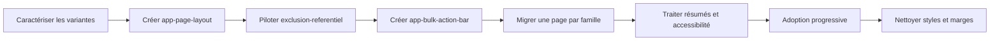

# Plan de création de `app-page-layout`

> **Statut** : socle, barre bulk et pilote implémentés ; adoption progressive restante  
> **Périmètre audité** : frontend Angular, état du dépôt au 23 août 2026  
> **Cible** : primitive structurelle Angular 22+ pour les vues/pages applicatives, sans logique métier

## État d’implémentation

Implémenté le 23 août 2026 :

- `app-page-layout` standalone, `OnPush`, avec les zones `pageHeader`, `pageGuidance`, `pageContext` et body par défaut ;
- densités `compact`/`default`, `ariaLabel`, `labelledBy`, absence de surface et absence d’overflow imposé ;
- masquage sans espacement des zones optionnelles vides ;
- `app-bulk-action-bar` standalone avec compteur accordé, région nommée, annonce `aria-live`, actions projetées et reflow mobile ;
- exports dans le barrel du Design System ;
- migration pilote de `exclusion-referentiel` ;
- suppression de l’import SCSS bulk devenu inutile dans le pilote ;
- 10 tests unitaires ciblés réussis ;
- lint ciblé réussi ;
- build Angular de développement réussi.

Restent volontairement progressifs : migration des autres familles de vues/pages, extraction éventuelle de `app-summary-bar`, amélioration sémantique du heading de `app-toolbar` et nettoyage du partial bulk lorsque son dernier consommateur aura été migré.

## 1. Décision

Créer un composant standalone `app-page-layout` dans `app/shared/ui/page-layout/`, destiné à former la racine structurelle d’une **vue/page applicative**.

La création est pertinente : 89 gabarits utilisent actuellement `<app-toolbar>` et une large majorité suit la même composition verticale :

1. en-tête d’écran ;
2. aide ou information contextuelle ;
3. contexte temporaire — résumé, sélection, statut ou actions groupées ;
4. contenu métier — tableau, grille, formulaire, dashboard ou cartes.

La page [`exclusion-referentiel`](../pharmaSmart-app/src/main/webapp/app/features/declaration-ca/feature/exclusion-referentiel/exclusion-referentiel.component.html) représente exactement ces quatre niveaux : toolbar, deux hints, barre d’actions conditionnelle et tableau.

Le nouveau composant normalise **la structure et le rythme vertical d’une vue/page**, mais ne devient pas un composant monolithique. Il orchestre des contenus projetés sans connaître leurs types ni leur logique.

Dans ce plan, une « page » désigne aussi bien :

- une vue directement associée à une route ;
- une vue fonctionnelle affichée dans un onglet ou dans le contenu d’un layout de domaine ;
- une vue différée qui possède son propre titre, ses outils et son contenu métier.

Un composant enfant local, une cellule, un fragment réutilisable ou le contenu d’une modale n’est pas une page et ne doit pas recevoir automatiquement ce wrapper.

### 1.1 Nom retenu

Le nom recommandé est `app-page-layout`, plutôt que `app-page-shell` ou simplement `app-page` :

- un « shell » suggère la possession de la navigation, de la route et du viewport applicatif ;
- `app-page` pourrait laisser croire que le composant porte le titre, les données et le cycle de vie métier de la vue ;
- ces responsabilités appartiennent déjà aux layouts de domaine, au routeur et à `app-nav-sidebar` ;
- le suffixe `layout` indique clairement que le composant ne fait que structurer la vue/page.

### 1.2 Responsabilités

`app-page-layout` doit :

- imposer l’ordre des grandes zones de page ;
- appliquer un espacement vertical cohérent entre elles ;
- supprimer progressivement les assemblages locaux de `mt-*` et `mb-*` entre zones ;
- poser `min-width: 0` afin que les tables, grilles et formulaires larges restent contenus ;
- proposer une densité compacte ou normale ;
- permettre de nommer la région de page pour l’accessibilité ;
- rester compatible avec une vue de route complète ou une vue fonctionnelle rendue dans `app-nav-sidebar` ;
- ne produire aucun espacement lorsqu’une zone optionnelle ne rend rien.

`app-page-layout` ne doit pas :

- créer automatiquement `app-toolbar` ;
- dupliquer les entrées `title`, `code`, `icon`, `filters` ou `actions` de `app-toolbar` ;
- connaître `app-hint`, `app-data-table`, `app-data-grid`, les formulaires ou les dashboards ;
- gérer chargement, erreurs, permissions, filtres, sélection, pagination ou appels HTTP ;
- inspecter les composants projetés pour déduire un comportement ;
- imposer `container-fluid`, une largeur ou un overflow ;
- rendre un `<main>`, car le layout applicatif possède déjà le landmark principal ;
- absorber immédiatement la classe globale `.pharma-smart-content` ;
- accepter des classes Bootstrap arbitraires en entrée.

---

## 2. Résultat de l’audit

### 2.1 Fréquence

L’inventaire trouve **89 usages** de `<app-toolbar>` dans les gabarits Angular :

- 43 dans `features/` ;
- 43 dans `entities/` ;
- 3 dans `admin/`.

De nombreuses vues concernées utilisent également `.pharma-smart-content`, directement ou via un layout parent. Les espacements varient entre `p-1`, `p-2`, `py-1`, `p-3`, `p-4` et `p-5`, sans contrat explicite.

### 2.2 Primitives déjà présentes

Le Design System possède déjà :

- [`app-toolbar`](../pharmaSmart-app/src/main/webapp/app/shared/ui/toolbar/toolbar.component.ts), avec projections `toolbarHeaderExtra`, `toolbarFilters` et `toolbarActions` ;
- [`app-action-bar`](../pharmaSmart-app/src/main/webapp/app/shared/ui/action-bar/action-bar.component.ts), destinée aux composants enfants qui ne portent pas le titre principal ;
- `app-hint`, pour les conseils contextuels ;
- `app-data-table`, `app-card`, `app-kpi-strip`, `app-nav-tabs` et `app-nav-sidebar` ;
- le style partagé [`_bulk-action-bar.scss`](../pharmaSmart-app/src/main/webapp/app/shared/scss/_bulk-action-bar.scss), qui n’est pas encore un composant.

Aucune primitive existante ne définit l’enchaînement toolbar → guidance → contexte → body. Le besoin n’est donc pas couvert aujourd’hui.

### 2.3 Familles de pages observées

#### A. Liste simple

Structure dominante : surface `.pharma-smart-content`, toolbar, puis table avec une marge locale.

Exemples : clients, dépôts, ventes en cours, facturation, lots périmés et nombreux rapports.

#### B. Liste avec aide et actions groupées

Structure : toolbar, un ou plusieurs hints, barre de sélection conditionnelle, puis table.

Exemples : [`exclusion-referentiel`](../pharmaSmart-app/src/main/webapp/app/features/declaration-ca/feature/exclusion-referentiel/exclusion-referentiel.component.html) et [`produit-home`](../pharmaSmart-app/src/main/webapp/app/features/products/feature/produit-home/produit-home.component.html).

#### C. Liste ou rapport avec résumé

Plusieurs pages de ventes reproduisent une `.journal-summary-bar` entre toolbar et table, notamment [`sales-journal`](../pharmaSmart-app/src/main/webapp/app/features/sales/feature/sales-journal/sales-journal.component.html).

#### D. Formulaire

Structure : toolbar avec actions annuler/enregistrer, alertes ou progression, puis formulaire, cards ou onglets.

Exemple : [`app-config-editor`](../pharmaSmart-app/src/main/webapp/app/features/settings/feature/app-config-editor/app-config-editor.component.html).

#### E. Vue/page incluse dans un layout de domaine

Une vue fonctionnelle reste une page au sens du Design System même lorsqu’elle est affichée dans un onglet plutôt que directement par une route. Son fond, son arrondi et son padding peuvent alors être fournis par `contentColumnClass` du parent. C’est le cas de [`declaration-ca-layout`](../pharmaSmart-app/src/main/webapp/app/features/declaration-ca/feature/declaration-ca-layout/declaration-ca-layout.component.html), qui rend `exclusion-referentiel` dans `app-nav-sidebar`.

Le nouveau composant ne doit donc pas supposer qu’il est toujours la racine visuelle de la route.

### 2.4 Duplications et défauts actuels

- marges `mt-*`/`mb-*` posées manuellement entre les mêmes zones ;
- padding de page variable et non documenté ;
- barres de résumé recréées sur plusieurs écrans ;
- barre bulk fournie par un partial SCSS, mais markup et accessibilité répétés ;
- absence d’un ordre structurel explicite pour les hints, alertes et statuts ;
- responsive traité localement par chaque écran ;
- risque de double surface ou double padding lorsque le layout parent porte déjà `.pharma-smart-content` ;
- titres de `app-toolbar` rendus dans un `<span>` plutôt que comme heading sémantique ;
- certains champs de recherche et cases de sélection sans nom accessible explicite.

---

## 3. Architecture proposée

### 3.1 Arborescence

```text
shared/ui/page-layout/
├── page-layout.component.ts
├── page-layout.component.html
├── page-layout.component.scss
└── page-layout.component.spec.ts
```

Le composant est exporté depuis [`app/shared/ui/index.ts`](../pharmaSmart-app/src/main/webapp/app/shared/ui/index.ts).

Aucun service, modèle métier ou package npm supplémentaire n’est nécessaire.

### 3.2 Zones de projection

| Zone | Cardinalité | Contenu attendu |
|---|---:|---|
| `[pageHeader]` | 1 | `app-toolbar` ou en-tête spécialisé |
| `[pageGuidance]` | 0–1 groupe | Un ou plusieurs hints, avertissements ou explications |
| `[pageContext]` | 0–1 groupe | Barre bulk, résumé, statut ou navigation secondaire |
| projection par défaut | 1 | Table, grille, formulaire, dashboard, cartes ou contenu libre |

Les zones sont génériques. Aucun slot `pageTable`, `pageForm`, `pageBulkActions` ou `pageSummaryItems` ne doit être introduit.

Le groupe `pageGuidance` permet un petit espacement entre plusieurs aides liées, puis un espacement standard avant la zone suivante. Les zones optionnelles vides ne doivent générer ni wrapper visible ni `gap` résiduel.

### 3.3 API Angular 22+

API publique minimale :

```typescript
export type PageLayoutDensity = 'compact' | 'default';

export class PageLayoutComponent {
  readonly density = input<PageLayoutDensity>('default');
  readonly labelledBy = input('');
  readonly ariaLabel = input('');
}
```

Contraintes :

- composant standalone ;
- `ChangeDetectionStrategy.OnPush` ;
- entrées signal avec `input()` ;
- aucune sortie, car le layout n’émet aucun événement métier ;
- aucune injection de route, store ou service ;
- aucun `@Input()`, `@Output()`, `*ngIf`, `*ngFor` ou NgModule ;
- aucun `Renderer2`, `ElementRef`, observer ou timer ;
- pas d’API ouverte `layoutClass`, `bodyClass`, `gap`, `paddingClass` ou `style`.

Si la présence des zones doit être détectée pour la sémantique, utiliser des directives marqueurs et les requêtes signal `contentChild()` ; ne pas parcourir le DOM projeté.

### 3.4 Structure de rendu cible

Structure conceptuelle :

```html
<div
  class="app-page-layout"
  [class.app-page-layout--compact]="density() === 'compact'"
  [attr.aria-label]="ariaLabel() || null"
  [attr.aria-labelledby]="labelledBy() || null"
  [attr.role]="ariaLabel() || labelledBy() ? 'region' : null"
>
  <header class="app-page-layout__header">
    <ng-content select="[pageHeader]" />
  </header>

  <div class="app-page-layout__guidance">
    <ng-content select="[pageGuidance]" />
  </div>

  <div class="app-page-layout__context">
    <ng-content select="[pageContext]" />
  </div>

  <div class="app-page-layout__body">
    <ng-content />
  </div>
</div>
```

La structure finale doit vérifier que les wrappers des zones absentes n’ajoutent pas d’espace. Une solution CSS bornée avec `:empty` est acceptable si elle fonctionne avec les ancres Angular ; sinon des marqueurs de contenu projeté doivent piloter le rendu avec `@if`.

### 3.5 Style et responsive

Le composant doit utiliser un flux vertical ou une grille à une colonne :

- `display: grid` ;
- `min-width: 0` sur le host et toutes les zones ;
- `gap` issu de tokens Design System ;
- aucune marge extérieure imposée ;
- aucun overflow horizontal ou vertical ;
- aucun fond ni border-radius dans la première version ;
- aucune règle profonde visant toolbar, hints, tables ou formulaires.

Densités proposées :

| Densité | Espacement principal | Usage |
|---|---:|---|
| `compact` | `0.5rem` | panneaux dans sidebar, listes très denses |
| `default` | `0.75rem` | pages standard et formulaires |

Le responsive du layout se limite à ajuster ce rythme. Le reflow des filtres reste la responsabilité de `app-toolbar`, celui des actions groupées celle du futur `app-bulk-action-bar`, et le scroll des données celle de `app-data-table` ou `app-data-grid`.

Le layout ne doit jamais créer un second conteneur `overflow-x: auto` autour d’une table ou d’une grille.

### 3.6 Surface `.pharma-smart-content`

La première version ne doit pas intégrer automatiquement `.pharma-smart-content`, car :

- certains écrans la posent eux-mêmes ;
- d’autres la reçoivent de `app-nav-sidebar` via `contentColumnClass` ;
- des dashboards et éditeurs ont des besoins de surface particuliers ;
- une adoption immédiate produirait des doubles paddings et doubles fonds.

Après plusieurs pilotes, une primitive orthogonale `app-page-surface` pourra être évaluée. Elle ne doit pas être fusionnée prématurément avec `app-page-layout`.

---

## 4. Composition cible de `exclusion-referentiel`

La page est le meilleur pilote car elle exerce toutes les zones sans logique de layout complexe.

Structure cible indicative :

```html
<app-page-layout density="compact" [labelledBy]="pageHeadingId">
  <app-toolbar
    ngProjectAs="[pageHeader]"
    [code]="navCode()"
    [title]="titre()"
    icon="pi pi-eye-slash"
  >
    <!-- badge, filtres et actions inchangés -->
  </app-toolbar>

  <ng-container ngProjectAs="[pageGuidance]">
    <app-hint [storageKey]="'exclusion-' + referentiel()">…</app-hint>
    <app-hint [storageKey]="'exclusion-cocher-key-' + referentiel()">…</app-hint>
  </ng-container>

  @if (nombreSelectionnes() > 0) {
    <app-bulk-action-bar
      ngProjectAs="[pageContext]"
      [count]="nombreSelectionnes()"
      label="sélectionné"
      labelPlural="sélectionnés"
    >
      <!-- actions Exclure/Réintégrer -->
    </app-bulk-action-bar>
  }

  <app-data-table ...>
    <!-- colonnes inchangées -->
  </app-data-table>
</app-page-layout>
```

La logique `charger()`, `appliquer()`, les signaux de filtre et de sélection et le tableau restent dans le composant métier.

Le `mb-3` actuel de la barre bulk disparaît : l’espacement entre contexte et body appartient au layout.

### 4.1 Ajustements UX/accessibilité révélés par le pilote

Ces améliorations sont pertinentes mais restent des chantiers distincts du layout :

1. faire évoluer `app-toolbar` afin que le titre soit un heading avec identifiant et niveau configurables ;
2. donner un nom accessible au champ de recherche, au minimum avec `aria-label` ;
3. ajouter `ariaLabel` et `ariaLabelledBy` à `app-checkbox` ;
4. nommer les cases « Sélectionner tous les éléments affichés » et « Sélectionner {libellé} » ;
5. distinguer le conseil général de l’avertissement concernant les ventes déjà closes ;
6. clarifier les badges avec « Exclu du CA » et « Inclus dans le CA » après validation métier ;
7. décider explicitement si une sélection masquée par le filtre est conservée, vidée ou signalée ;
8. fournir un nom accessible au tableau via une évolution de `app-data-table`.

---

## 5. Composants adjacents recommandés

`app-page-layout` suffit pour la structure, mais l’audit justifie deux primitives indépendantes. Elles ne doivent pas être implémentées à l’intérieur du layout.

### 5.1 `app-bulk-action-bar`

Le partial SCSS actuel est réutilisé par plusieurs écrans, mais le markup, le compteur et le comportement responsive restent dupliqués.

Responsabilités proposées :

- afficher un compteur de sélection ;
- projeter les actions ;
- fournir une région ou un groupe accessible ;
- annoncer sobrement les changements de compteur avec `aria-live="polite"` ;
- gérer le retour à la ligne et les petites largeurs ;
- permettre une action de désélection projetée, sans l’imposer.

API indicative :

```typescript
count = input.required<number>();
label = input('élément sélectionné');
labelPlural = input('éléments sélectionnés');
ariaLabel = input('Actions sur la sélection');
```

### 5.2 `app-summary-bar`

Les résumés de ventes dupliquent structure et SCSS. Une primitive projetée est préférable à un tableau rigide de métadonnées, car les valeurs peuvent contenir devise, badge, lien ou état conditionnel.

Zones possibles : projection par défaut de `app-summary-item`, ou items entièrement projetés avec structure accessible. Ce composant doit faire l’objet d’un mini-contrat séparé avant implémentation.

---

## 6. Plan d’implémentation

### Phase 0 — Caractérisation

1. Figer l’inventaire des 89 usages de toolbar.
2. Échantillonner au moins :
   - une liste simple ;
   - `exclusion-referentiel` ;
   - une page avec résumé ;
   - un formulaire ;
   - un dashboard ;
   - un panneau dans `app-nav-sidebar` ;
  - une modale utilisant toolbar, qui doit rester hors migration puisqu’elle n’est pas une vue/page.
3. Relever pour chaque échantillon : surface fournie par le parent, padding, marges, overflow et comportement mobile.
4. Capturer des références visuelles avant modification.
5. Définir les tokens de gap compact/default.

**Sortie** : matrice des variantes et captures de référence.

### Phase 1 — Socle `app-page-layout`

1. Créer le composant standalone `OnPush`.
2. Implémenter les quatre zones projetées.
3. Garantir l’absence de gap pour les zones vides ou conditionnelles.
4. Ajouter `density`, `labelledBy` et `ariaLabel`.
5. Ajouter les styles bornés du layout, sans `::ng-deep`.
6. Exporter le composant dans le barrel UI.
7. Documenter les responsabilités et anti-responsabilités dans le TSDoc.

**Critère** : le composant structure tout contenu projeté sans modifier son comportement ni son overflow.

### Phase 2 — Pilote `exclusion-referentiel`

1. Envelopper les quatre zones dans `app-page-layout`.
2. Conserver `.pharma-smart-content p-1` sur le parent `declaration-ca-layout`.
3. Retirer uniquement les marges extérieures devenues inutiles.
4. Vérifier les trois variantes : rayon, tiers-payant et aucun résultat.
5. Tester l’apparition/disparition de la zone bulk.
6. Comparer visuellement avant/après sur mobile et desktop.
7. Vérifier que le tableau garde son propre scroll horizontal.

**Critère** : aucun changement métier, aucun double padding et aucun saut d’espacement lorsque la sélection vaut zéro.

### Phase 3 — `app-bulk-action-bar`

1. Transformer le partial existant en composant du Design System tout en conservant le rendu visuel.
2. Ajouter compteur, projection d’actions, accessibilité et responsive.
3. Migrer d’abord `exclusion-referentiel` et `produit-home`.
4. Migrer ensuite facturation et gestion des péremptions.
5. Supprimer le partial seulement lorsqu’aucun consommateur ne subsiste.

**Critère** : toutes les barres bulk ont le même reflow, le même espacement et un nom accessible.

### Phase 4 — Pilotes représentatifs

Migrer un écran de chaque famille :

1. liste simple ;
2. rapport avec résumé ;
3. formulaire à onglets ;
4. dashboard ;
5. écran dans sidebar.

Ne pas migrer les modales, éditeurs plein écran ou pages au layout exceptionnel sans validation explicite.

**Critère** : le contrat couvre les variantes sans ajout d’entrées métier ou de classes échappatoires.

### Phase 5 — Résumés et accessibilité

1. Concevoir puis implémenter `app-summary-bar` si les pilotes confirment une structure commune.
2. Faire évoluer séparément le heading de `app-toolbar`.
3. Ajouter les noms accessibles manquants aux contrôles partagés.
4. Ajouter `ariaLabel`/`ariaLabelledBy` à `app-data-table` et `app-checkbox`.

### Phase 6 — Adoption progressive

Ordre recommandé :

1. pages avec toolbar + hints ;
2. pages avec toolbar + bulk bar ;
3. pages avec toolbar + résumé ;
4. listes simples ;
5. formulaires ;
6. dashboards compatibles.

Chaque migration doit rester un changement mécanique local et conserver les sorties, signaux et services existants.

### Phase 7 — Nettoyage

Après adoption suffisante :

1. supprimer les marges locales remplacées par les gaps du layout ;
2. supprimer les styles bulk et summary devenus orphelins ;
3. documenter les exceptions qui ne doivent pas utiliser le layout ;
4. évaluer séparément `app-page-surface` ;
5. ajouter la convention à la documentation du Design System et aux instructions du dépôt.

Aucun remplacement automatique des 89 écrans ne doit être effectué avant validation des pilotes.

---

## 7. Tests

### 7.1 Tests unitaires de `app-page-layout`

- projection et ordre header → guidance → contexte → body ;
- projection du body par défaut ;
- zone guidance contenant plusieurs éléments ;
- zone contexte ajoutée/retirée par `@if` ;
- absence d’espace pour une zone vide ;
- classes correspondant aux deux densités ;
- `role="region"` uniquement lorsqu’un nom accessible est fourni ;
- priorité et comportement de `labelledBy`/`ariaLabel` ;
- absence de `<main>` ;
- absence d’overflow imposé ;
- événements et formulaires projetés inchangés.

### 7.2 Tests d’intégration

- les projections internes de `app-toolbar` fonctionnent lorsqu’elle est elle-même projetée dans `pageHeader` ;
- plusieurs `app-hint` restent dismissibles indépendamment ;
- une barre contextuelle conditionnelle ne laisse aucun gap après disparition ;
- `app-data-table` et `app-data-grid` conservent leur scroll ;
- un formulaire réactif conserve soumission et validation ;
- un écran enfant d’`app-nav-sidebar` ne reçoit pas de double surface ou padding.

### 7.3 Tests visuels et responsive

Captures minimales à 320, 576, 768, 1024 et 1440 px avec :

- titre français long ;
- toolbar compacte avec plusieurs filtres ;
- zéro, une et plusieurs sélections ;
- un et deux hints ;
- actions bulk longues ;
- tableau chargé, vide et en chargement ;
- formulaire avec alertes ;
- page incluse dans une sidebar.

### 7.4 Accessibilité

- ordre visuel identique à l’ordre DOM ;
- région nommée sans landmark `<main>` imbriqué ;
- hiérarchie correcte des headings ;
- recherche et cases à cocher nommées ;
- barre bulk annoncée sans annonces excessives ;
- navigation clavier inchangée ;
- contraste des variantes d’aide et d’avertissement.

---

## 8. Risques et mesures

| Risque | Niveau | Mesure |
|---|---:|---|
| Composant monolithique dupliquant toolbar et body | Élevé | Projection générique et API limitée à trois entrées |
| Double padding dans les layouts de domaine | Élevé | Ne pas intégrer `.pharma-smart-content` en phase 1 |
| Espacement laissé par une zone conditionnelle vide | Élevé | Test `@if`, `:empty` validé ou directives marqueurs |
| Double scrollbar autour des tables/grilles | Élevé | Aucun overflow dans le layout |
| Régression des projections de toolbar | Moyen | Test d’intégration avec projections imbriquées |
| Multiplication d’options de présentation | Moyen | Interdire classes Bootstrap, gap et styles arbitraires en entrées |
| Migration massive difficile à valider | Moyen | Pilotes par famille puis adoption progressive |
| Landmarks ou headings invalides | Moyen | Pas de `<main>`, région nommée optionnelle et chantier toolbar séparé |
| Double fond ou arrondi | Moyen | Surface hors du composant initial |
| Responsive métier cassé | Moyen | Le layout ne réorganise pas le contenu de ses enfants |

---

## 9. Anti-patterns interdits

- `app-page-layout` recevant `title`, `icon`, `filters`, `actions`, `rows` ou `loading` ;
- un objet géant `PageConfig` ;
- création automatique d’`app-toolbar` ;
- génération dynamique de filtres à partir de métadonnées ;
- slots différents pour table, formulaire, dashboard ou chaque cas métier ;
- détection du type des composants projetés ;
- logique de permissions ou d’appels serveur dans le Design System ;
- `<main>` dans chaque page ;
- `::ng-deep` depuis le layout ;
- `overflow: auto` sur le body du layout ;
- inputs `layoutClass`, `bodyClass`, `paddingClass` ou valeurs CSS libres ;
- migration simultanée de tous les écrans ;
- usage systématique dans les modales et éditeurs plein écran ;
- fusion de page-layout, toolbar, hint, bulk bar et data-table en un composant universel.

---

## 10. Critères globaux de fin

Le chantier est terminé lorsque :

- `app-page-layout` existe comme composant standalone Angular 22+, `OnPush` et sans dépendance métier ;
- les quatre zones sont documentées et testées ;
- les zones optionnelles vides ne produisent aucun espace ;
- le composant n’impose ni surface, ni largeur, ni overflow ;
- `exclusion-referentiel` est migré et validé comme pilote ;
- au moins un écran de chaque famille compatible est migré ;
- les captures visuelles ne montrent aucune régression de surface ou responsive ;
- les tables et grilles ne présentent aucune double scrollbar ;
- le layout fonctionne à la racine d’une route et dans `app-nav-sidebar` ;
- seuls les composants constituant réellement une vue/page utilisent `app-page-layout` ; les fragments enfants et modales restent exclus ;
- `app-bulk-action-bar` remplace les duplications confirmées sans être couplé au layout ;
- aucune API métier ou classe échappatoire générale n’a été ajoutée ;
- lint, tests Angular et build de production passent ;
- les exceptions sont explicitement documentées.

---

## 11. Ordre résumé



La recommandation finale est donc de créer **une primitive `app-page-layout` légère et compositionnelle**, complétée indépendamment par `app-bulk-action-bar`. Cette approche standardise l’architecture récurrente sans déplacer la logique des écrans dans le Design System.
