# Plan de conversion d’AG Grid vers `app-data-grid`

> **Statut** : implémentation commencée — socle natif de lecture livré, migrations métier et édition restantes  
> **Périmètre audité** : frontend Angular, état du dépôt au 23 août 2026  
> **Cible** : composant natif Angular 22+ du Design System `app-data-grid`, sans bibliothèque de grille tierce  
> **Décision irréversible** : après migration des sept usages, AG Grid est supprimé du code source, des styles, des dépendances et du lockfile

## État d’implémentation

### Premiers incréments livrés le 23 août 2026

Le socle natif `app-data-grid` existe désormais dans `app/shared/ui/data-grid/` et est exporté par le barrel du Design System.

Capacités livrées :

- contrats génériques strictement typés pour colonnes, lignes, cellules, tri et détail ;
- composant standalone `OnPush`, API `input()`/`model()`/`output()` et état dérivé par `computed()` ;
- table Bootstrap sémantique avec rôle `grid`, index ARIA et nom accessible ;
- viewport horizontal/vertical, hauteur fixe ou maximale et en-tête sticky ;
- colonnes visibles/masquées, largeur/min/max/flex, alignement et colonnes figées gauche/droite avec offsets cumulés ;
- colonnes redimensionnables au pointeur et au clavier, contraintes par `minWidth`/`maxWidth`, avec double-clic ou touche `Home` pour rétablir la largeur déclarée ;
- colonnes de taille fixe via `resizable: false`, dont la largeur effective verrouille simultanément largeur minimale et maximale ;
- poignée de resize accessible avec rôle `separator`, valeurs ARIA et pas clavier de 10 px ou 1 px avec `Shift` ;
- largeurs redimensionnées conservées dans un état interne immuable et notification métier via `columnResize`, sans mutation des définitions de colonnes reçues ;
- focus roving et navigation automatique entre cellules par flèches, `Home`/`End`, `Ctrl+Home`/`Ctrl+End`, `Entrée`, `Tab` et leurs variantes avec `Shift` ;
- premier éditeur natif texte/nombre avec `editable`, validation min/max/longueur/callback et équivalents de `enableCellEditingOnBackspace`, `enterNavigatesVerticallyAfterEdit`, `singleClickEdit` et `stopEditingWhenCellsLoseFocus` ;
- événements typés `cellEditingStarted`, `cellValueChanged` et `cellEditingStopped`, sans mutation implicite des lignes reçues ;
- valeur par champ ou callback, format texte, classes conditionnelles et tooltip natif ;
- templates Angular projetés et typés via `appDataGridCell` ;
- tri client simple sans mutation des lignes reçues et quick filter ciblé ;
- sélection simple/multiple, cases de ligne et case d’en-tête ;
- master/detail projeté via `appDataGridDetail`, ouverture simple ou multiple par clé stable ;
- états vide et chargement ;
- styles de focus visibles et respect de `prefers-reduced-motion` ;
- dix tests ciblés réussis couvrant rendu, templates, tri immuable, filtre, sélection, détail, sticky/scroll, états, resize pointeur/clavier, bornes et taille fixe.

Ces premiers incréments ne remplacent encore aucun des sept écrans AG Grid : ils fixent et testent le socle avant les migrations métier. Restent notamment à livrer avant le pilote BED : ajustement automatique à la largeur disponible, commit/rollback asynchrone, API impérative de reprise d’édition, navigation inter-pages, flash/scan et réconciliation avancée pendant édition.

AG Grid demeure donc temporairement installé et actif jusqu’à l’achèvement des phases de migration et de nettoyage.

## 1. Décision proposée

Créer `app-data-grid` dans `pharmaSmart-app/src/main/webapp/app/shared/ui/data-grid/` comme composant standalone du Design System.

### Motivation principale : ne pas charger une bibliothèque complète pour un besoin limité

L’objectif premier est de **ne plus embarquer toute une bibliothèque de grille généraliste** alors que PharmaSmart n’en utilise qu’un sous-ensemble restreint : affichage tabulaire, quelques colonnes calculées, sélection, édition texte/nombre et navigation clavier.

AG Grid fournit de nombreuses capacités absentes des besoins actuels — pivot, groupement avancé, graphiques, formules, modèles de lignes multiples, plages, fill handle, menus complexes, export et modules Enterprise — mais son runtime, ses styles, son abstraction et ses mises à jour restent chargés et maintenus pour seulement sept grilles.

La cible applique donc les règles suivantes :

- **zéro dépendance de grille tierce** : ni AG Grid, ni TanStack Table, ni Handsontable, ni autre moteur équivalent ;
- utiliser uniquement Angular, les API natives du navigateur, Bootstrap 5 déjà présent et les composants existants du Design System ;
- aucun nouveau package npm pour le tri, le redimensionnement, le focus, la navigation, la sélection ou l’édition ;
- implémenter seulement les capacités démontrées par l’inventaire des usages actuels ;
- garder le code chargeable par route grâce aux composants standalone, sans registre global de modules ;
- mesurer le coût produit par le nouveau composant dans les bundles initial et lazy, avec un budget explicite ;
- refuser l’élargissement « au cas où » : toute capacité future devra correspondre à un besoin métier et à des tests.

La coexistence avec AG Grid est strictement transitoire, écran par écran. Il n’est pas prévu de conserver AG Grid comme solution de secours, dépendance optionnelle, adaptateur de compatibilité ou implémentation cachée derrière `app-data-grid`. La dernière phase de la migration doit rendre impossible son chargement dans n’importe quel chunk de l’application.

Le gain attendu n’est pas seulement la taille du bundle. Cette approche supprime également :

- l’enregistrement répété de `AllCommunityModule` ;
- les types et APIs AG Grid diffusés dans les composants métier ;
- les styles globaux `.ag-*` et le thème Alpine ;
- les renderers dépendant de `ICellRendererAngularComp` ;
- les adaptations imposées par les changements de version d’une bibliothèque généraliste.

`app-data-grid` doit :

- reprendre la base visuelle de [`app-data-table`](../pharmaSmart-app/src/main/webapp/app/shared/ui/data-table/) : table Bootstrap 5, couleurs, bordures, densités, état vide, voile de chargement, défilement, colonnes figées et conventions du Design System ;
- se distinguer par une **édition centralisée en grille**, avec comportement de type Excel : cellule active, navigation au clavier, entrée en édition, validation, annulation, passage automatique à la cellule suivante et pilotage impératif du focus ;
- fournir nativement le **master/detail**, la scrollabilité horizontale et verticale et un en-tête fixe dans le viewport de la grille ;
- couvrir tous les usages fonctionnels actuellement fournis par `ag-grid-angular` dans le projet ;
- exposer des types métier propres au Design System, sans recopier `ColDef`, `GridApi`, `ICellRendererParams` ou les noms AG Grid ;
- privilégier les templates Angular typés et les composants du Design System plutôt que les chaînes HTML construites dans les définitions de colonnes ;
- conserver `app-data-table` pour les tableaux de consultation, pagination et regroupement qui ne nécessitent pas une saisie tabulaire intensive. Les deux composants peuvent proposer un master/detail, mais `app-data-grid` doit garantir sa coexistence avec l’édition, la navigation clavier, les colonnes figées et le scroll interne.

La cible n’est donc **pas** un simple wrapper `<app-data-grid>` autour de `<ag-grid-angular>`. Un wrapper conserverait le poids, les APIs, les styles et la dépendance à AG Grid tout en ajoutant une seconde abstraction. Une façade temporaire n’est acceptable que dans une branche de migration, jamais comme architecture finale. Il ne faut pas non plus remplacer AG Grid par une autre bibliothèque de grille : cela déplacerait le problème sans répondre à l’objectif d’allègement.

### 1.1 Référence Angular

L’implémentation doit suivre les pratiques et recommandations de la version Angular réellement déclarée par le projet, actuellement Angular 22+, et non reproduire des patterns historiques issus d’Angular avec NgModules ou d’anciens composants de table.

Règles obligatoires :

- composant, directives et éditeurs **standalone** ; aucun `NgModule` ;
- API publique fondée sur `input()`, `input.required()`, `model()` et `output()` ;
- état interne porté par `signal()`, état dérivé par `computed()` et `linkedSignal()` uniquement lorsqu’un état local réinscriptible doit suivre une entrée ;
- `effect()` réservé à la synchronisation avec un système externe ; ne pas l’utiliser pour recopier des signaux ou calculer un état dérivé ;
- requêtes signal avec `contentChild()`, `contentChildren()`, `viewChild()` et `viewChildren()` ;
- syntaxe de template native `@if`, `@for`, `@switch` et `@let` ; aucun `*ngIf` ou `*ngFor` ;
- suivi obligatoire des lignes et colonnes dans les `@for` par leurs clés stables ; jamais par identité implicite d’objet pour les données renouvelées ;
- `ChangeDetectionStrategy.OnPush` pour tous les composants du nouveau dossier ; les changements reposent sur les signaux et nouvelles références, pas sur une détection globale forcée ;
- injection par `inject()` et contrats via `InjectionToken`/classe abstraite lorsque nécessaire ; pas d’injection par constructeur ajoutée au nouveau composant ;
- nettoyage des abonnements avec `takeUntilDestroyed()` et `DestroyRef` ; aucun `Subject<void>` de destruction manuel ;
- utiliser `afterNextRender()`/`afterRenderEffect()` pour les opérations qui exigent que le DOM soit rendu, plutôt que des `setTimeout()` arbitraires ;
- enregistrer et nettoyer explicitement `ResizeObserver`, listeners natifs et tâches planifiées via `DestroyRef.onDestroy()` ;
- formulaires et éditeurs strictement typés ; aucune propagation de `any` dans l’API publique ;
- privilégier les classes et styles liés dans le template ou le `host` du composant ; éviter `Renderer2`, `ElementRef` et la manipulation DOM directe hors du moteur interne de focus/mesure ;
- ne pas introduire `ViewEncapsulation.None` par défaut. Si la projection de templates l’impose, borner les règles sous la classe racine `app-data-grid` et documenter la décision ;
- ne pas dépendre de Zone.js pour déclencher les mises à jour : les callbacks navigateur doivent écrire dans des signaux afin que le composant reste compatible avec une exécution zoneless ;
- protéger l’accès aux API navigateur (`document`, `ResizeObserver`, sélection, presse-papiers) et ne les utiliser qu’après rendu, afin de préserver testabilité et compatibilité avec les environnements sans DOM ;
- respecter le typage strict TypeScript 6 et les règles ESLint du dépôt.

Les API dépréciées Angular, les décorateurs historiques `@Input()`/`@Output()` pour le nouveau composant, les NgModules et les composants PrimeNG sont interdits dans cette implémentation.

---

## 2. Résultat de l’inventaire

### 2.1 Dépendances

Le projet déclare actuellement :

- `ag-grid-angular` `^36.1.0` ;
- `ag-grid-community` `^36.1.0` ;
- `@ag-grid-community/locale` `^36.1.0`, sans usage applicatif trouvé.

Chaque grille enregistre `AllCommunityModule`, souvent avec `ClientSideRowModelModule`. Tous les écrans audités utilisent le modèle de lignes client. Aucun usage Enterprise, server-side row model, regroupement AG Grid, pivot, graphique, export AG Grid ou menu de colonnes n’a été trouvé.

### 2.2 Grilles actives

Sept composants rendent actuellement `<ag-grid-angular>`.

| Domaine | Composant | Usage principal | Complexité de migration |
|---|---|---|---|
| Inventaire | [`inventory-lines-grid`](../pharmaSmart-app/src/main/webapp/app/features/inventory/ui/inventory-lines-grid/inventory-lines-grid.component.ts) | Comptage séquentiel par produit | Très élevée |
| Inventaire | [`inventory-lot-grid`](../pharmaSmart-app/src/main/webapp/app/features/inventory/ui/inventory-lot-grid/inventory-lot-grid.component.ts) | Comptage séquentiel par lot | Très élevée |
| Commande | [`commande-requested`](../pharmaSmart-app/src/main/webapp/app/features/commande/feature/commande-requested/commande-requested.component.ts) | Édition d’une commande et sélection multiple | Élevée |
| Réception | [`commande-received`](../pharmaSmart-app/src/main/webapp/app/features/commande/feature/commande-received/commande-received.component.ts) | Réception, scan, édition et lots dépliés | Critique |
| Suggestion | [`suggestion-produit-panel`](../pharmaSmart-app/src/main/webapp/app/features/commande/feature/suggestion/ui/suggestion-produit-panel/suggestion-produit-panel.component.ts) | Quantités, sélection, colonnes mensuelles dynamiques | Élevée |
| Réassort | [`suggestion-reassort`](../pharmaSmart-app/src/main/webapp/app/features/commande/feature/repartition-stock/ui/suggestion-reassort/suggestion-reassort.component.ts) | Quantité dans une grille imbriquée | Moyenne |
| BED | [`bed-detail`](../pharmaSmart-app/src/main/webapp/app/features/commande/feature/bon-entree-diverse/bed-detail/bed-detail.component.ts) | Quantité et prix d’achat | Faible à moyenne |

### 2.3 Renderers Angular liés à AG Grid

Sept renderers actifs implémentent `ICellRendererAngularComp` :

- [`CommandeRequestedLineActionsComponent`](../pharmaSmart-app/src/main/webapp/app/features/commande/feature/commande-requested/commande-requested-line-actions.component.ts) ;
- [`CommandeReceivedActionsComponent`](../pharmaSmart-app/src/main/webapp/app/features/commande/feature/commande-received/commande-received-actions.component.ts) ;
- [`CommandeReceivedStatutComponent`](../pharmaSmart-app/src/main/webapp/app/features/commande/feature/commande-received/commande-received-statut.component.ts) ;
- [`LotExpandCellComponent`](../pharmaSmart-app/src/main/webapp/app/features/commande/ui/lot/inline/lot-expand-cell.component.ts) ;
- [`LotInlineEditorComponent`](../pharmaSmart-app/src/main/webapp/app/features/commande/ui/lot/inline/lot-inline-editor.component.ts) ;
- [`SuggestionProduitActionsComponent`](../pharmaSmart-app/src/main/webapp/app/features/commande/feature/suggestion/ui/suggestion-produit-panel/suggestion-produit-actions.component.ts) ;
- [`BedLineActionsComponent`](../pharmaSmart-app/src/main/webapp/app/features/commande/feature/bon-entree-diverse/ui/bed-line-actions/bed-line-actions.component.ts).

[`CommandeBtnComponent`](../pharmaSmart-app/src/main/webapp/app/entities/commande/btn/commande-btn.component.ts) implémente également l’interface AG Grid, mais aucun `cellRenderer` ni autre consommateur n’a été trouvé. Il faut confirmer qu’il est mort puis le supprimer, plutôt que le porter.

### 2.4 Styles couplés à AG Grid

Le couplage ne se limite pas aux composants TypeScript :

- règles globales `.ag-*` dans [`global.scss`](../pharmaSmart-app/src/main/webapp/content/scss/global.scss) ;
- styles de grille dans les deux composants d’inventaire ;
- styles de lignes, cellules, badges et actions dans les écrans commande, réception, suggestion, BED et réassort ;
- utilisation simultanée du thème objet `themeAlpine` et, pour le réassort, des classes historiques `ag-theme-alpine`.

La migration doit donc inclure un inventaire/suppression des sélecteurs `.ag-*`, et pas uniquement le remplacement des balises Angular.

---

## 3. Capacités réellement utilisées

### 3.1 Colonnes et rendu

Les grilles actuelles utilisent :

- champ simple (`field`) et identifiant de colonne sans champ (`colId`) ;
- libellé et infobulle d’en-tête ;
- largeur fixe, largeur minimale/maximale et partage de l’espace par `flex` ;
- alignement texte, numérique et centré ;
- colonnes masquées statiquement ou selon des signaux métier ;
- colonnes figées à gauche et à droite ;
- tri client simple ;
- redimensionnement manuel et ajustement à la largeur disponible ;
- valeur calculée depuis toute la ligne ;
- formatage de valeur ;
- classes et styles conditionnels de cellule ;
- infobulles conditionnelles ;
- rendu riche : icône, badge, avertissement, statut, actions et indicateurs métier ;
- colonnes construites dynamiquement, notamment les trois mois de consommation et la VMM.

Les fonctions qui retournent du HTML sont nombreuses. Elles devront être remplacées par :

1. un formateur texte pour les cas simples ;
2. des classes sémantiques pour les couleurs ;
3. un template Angular projeté pour les cellules riches ;
4. exceptionnellement un composant Angular de cellule à entrées/sorties explicites.

`innerHTML` ou une API `renderer: () => string` ne doivent pas être reproduits : ils contournent l’échappement Angular, rendent l’accessibilité difficile et perpétuent le CSS spécifique aux écrans.

### 3.2 Édition

Les types d’édition actifs sont le texte et le nombre. Les règles rencontrées sont :

- édition conditionnelle par ligne et par état global ;
- simple clic et touche Retour arrière pour entrer en édition ;
- sélection du contenu à l’ouverture ;
- validation à `Entrée`, `Tab` ou perte de focus ;
- annulation/restauration de l’ancienne valeur ;
- minimum, maximum dynamique, entier et interdiction des flèches d’incrémentation ;
- émission d’un événement avec ligne, champ, ancienne et nouvelle valeur ;
- sauvegarde immédiate côté serveur ;
- rollback et réouverture de la cellule en cas de valeur invalide ou d’échec serveur ;
- recalcul/rafraîchissement de cellules dépendantes ;
- navigation verticale automatique après validation ;
- passage à la page serveur suivante pour les comptages d’inventaire.

### 3.3 Navigation et focus

Les usages dépassent une simple cellule éditable indépendante :

- cellule active identifiable même hors édition ;
- déplacement avec les flèches ;
- `Tab` / `Maj+Tab` entre cellules éditables ;
- `Entrée` / `Maj+Entrée` verticalement ;
- `F2`, simple clic, double clic, frappe directe et Retour arrière pour éditer ;
- `Échap` pour restaurer la valeur précédente ;
- déplacement programmatique vers une ligne/colonne ;
- défilement de la ligne cible dans le viewport avant l’édition ;
- recherche d’une ligne par identité stable ;
- conservation du focus lorsque le tableau reçoit de nouvelles données ;
- verrouillage des mises à jour de lignes pendant une édition ou pendant l’ouverture asynchrone de l’éditeur.

C’est la différence structurante avec `app-data-table` et la raison d’un composant séparé.

### 3.4 Lignes et sélection

Les usages comprennent :

- identifiant stable de ligne, parfois composite ;
- sélection multiple avec case par ligne et case d’en-tête ;
- sélection désactivée au clic sur la ligne ;
- désélection globale programmée ;
- classes conditionnelles de ligne ;
- clic de ligne ;
- animation lors des changements ;
- flash temporaire d’une ligne/cellule après scan ;
- lignes de détail pleine largeur, de hauteur dynamique, insérées après une ligne métier ;
- mise à jour ciblée d’une ligne ou de quelques cellules.

Le master/detail est une capacité de premier rang et non un cas spécial propre à la réception. La ligne maître contrôle son expansion par une clé stable ; la ligne détail occupe toute la largeur logique de la table, reste dans le même scroller et accepte un template Angular arbitraire, y compris un composant éditable. Plusieurs détails peuvent être ouverts simultanément. Leur ouverture ne doit ni réinitialiser la sélection, ni déplacer silencieusement la cellule active, ni créer un second viewport horizontal.

### 3.5 Filtrage, pagination et état

- filtre rapide côté client dans l’inventaire produit et le panneau de suggestion ;
- filtres métier et pagination serveur gérés à l’extérieur de la grille ;
- pagination externe dans le panneau de suggestion ;
- aucune pagination interne AG Grid ;
- conservation volontaire du scroll lors d’un remplacement de données ;
- overlays de chargement réalisés par les écrans eux-mêmes.

`app-data-grid` doit fournir le filtre client et les états loading/vide, mais ne doit pas imposer une seconde pagination. Il peut reprendre les entrées de pagination de `app-data-table` pour les futurs besoins, tandis que les premières migrations peuvent garder leur pagination externe.

### 3.6 Viewport, scroll et en-tête fixe

La grille doit proposer un viewport interne explicite :

- défilement horizontal dès que la somme des largeurs minimales dépasse la largeur disponible ;
- défilement vertical lorsque `scrollHeight` ou `maxScrollHeight` borne la hauteur ;
- en-tête fixé en haut du viewport pendant le défilement vertical, sans sortir du conteneur de la grille ;
- synchronisation native du header et du body par une table unique, sans double scrollbar horizontale ;
- conservation optionnelle de `scrollTop` et `scrollLeft` lors du remplacement de `rows` ;
- déplacement programmatique d’une cellule ou ligne avec `scrollIntoView`, en respectant l’en-tête fixe et les colonnes figées ;
- propagation normale du scroll de page lorsque le viewport est arrivé à sa limite, sans piège clavier ou molette ;
- détail master/detail rendu dans le même viewport et pris en compte dans la hauteur défilable.

L’en-tête fixe est activé par défaut lorsque la grille est scrollable. Il doit conserver un fond opaque, un `z-index` défini par les tokens du Design System et une intersection correcte avec les colonnes figées à gauche ou à droite. En mode non scrollable, il reste dans le flux normal afin d’éviter un sticky relatif à la page entière.

---

## 4. Matrice de couverture par écran

### 4.1 Inventaire produit

Capacités à préserver :

- colonnes conditionnelles selon mode aveugle, seuil mini, gestion des lots et catégorie ABC ;
- formatage et styles d’écart, seuil, succès de saisie et échec de sauvegarde ;
- clic d’une ligne possédant des lots ;
- filtre rapide ;
- édition uniquement de `quantityOnHand` ;
- identité stable par `id` ;
- mise à jour de `updated` sans déclencher une nouvelle sauvegarde ;
- différé de la nouvelle page pendant l’édition ;
- rollback puis réouverture sur erreur ;
- navigation automatique et émission `nextPage` en fin de page ;
- maintien du scroll lors du renouvellement des données.

Cette grille est le **test de référence** du moteur de focus et de concurrence de mise à jour.

### 4.2 Inventaire par lot

Même couverture que l’inventaire produit, avec en plus :

- clé `lot-{id}` ou `line-{storeInventoryLineId}` ;
- deux APIs de sauvegarde selon que la ligne représente un lot existant ou un produit sans lot ;
- mise à jour ciblée de `gap`, `updated` et `version` ;
- voile de chargement.

### 4.3 Commande demandée

Capacités à préserver :

- sélection multiple et récupération des lignes sélectionnées ;
- classes danger, avertissement et code provisoire ;
- édition conditionnelle du CIP provisoire ;
- verrouillage des prix et quantités après soumission PharmaML ;
- éditeurs texte/nombre ;
- cellules riches signalant les écarts de tarifs ;
- actions de ligne ;
- sauvegarde dédiée selon le champ modifié ;
- hauteur pleine disponible dans un panneau.

### 4.4 Commande reçue

Capacités à préserver :

- colonnes dynamiques selon l’activation de la gestion de lots ;
- édition du CIP provisoire, quantité reçue et quantité gratuite ;
- confirmation d’une substitution de CIP et restauration en cas d’annulation ;
- recalcul de `afterStock` et du statut ;
- styles d’écarts prix, colisage et code provisoire ;
- colonnes masquées par défaut ;
- colonnes d’actions/lots figées à droite ;
- raccourci Espace sur la cellule Lots ;
- détail pleine largeur de lots avec hauteur variable ;
- défilement, focus et édition d’une ligne identifiée après scan ;
- flash d’une ligne après scan ;
- mise à jour ciblée des cellules ;
- alternance entre vue grille et vue séquentielle.

La ligne artificielle `{ __type: 'lot-editor' }` est un contournement AG Grid. La cible doit utiliser une vraie **ligne de détail projetée** associée à la ligne principale, comme le fait déjà `app-data-table`, sans polluer le modèle métier ni la collection `rows`.

### 4.5 Panneau de suggestion produit

Capacités à préserver :

- sélection multiple et sélection globale ;
- activation/désactivation dynamique des cases selon le filtre d’urgence ;
- filtre rapide et désélection au changement de filtre/page ;
- colonnes calculées et dynamiques : couverture après commande, trois mois, VMM/tendance ;
- tri de plusieurs colonnes ;
- quantité numérique éditable ;
- indicateurs de colisage, minimum fournisseur et verrou manuel ;
- classes urgence/normale ;
- actions reset/comparaison/suppression ;
- pagination externe ;
- redimensionnement automatique à la largeur.

### 4.6 Suggestion de réassort

Capacités à préserver :

- grille imbriquée dans le détail d’un `app-data-table` ;
- hauteur calculée entre 200 et 600 px ;
- numéro de ligne calculé ;
- colonnes figées gauche/droite ;
- styles et infobulles de niveau de stock ;
- quantité entière bornée par `stockAvailable` ;
- navigation verticale personnalisée dans la colonne quantité ;
- rollback, focus et réouverture après dépassement du stock ;
- suppression de ligne ;
- ajustement des colonnes à l’ouverture.

La configuration AG Grid affiche également des cases de sélection, sans gestionnaire de sélection trouvé. Avant migration, confirmer si elles ont une valeur fonctionnelle. À défaut, ne pas reproduire ce contrôle inutile.

### 4.7 Bon d’entrée diverse

Capacités à préserver :

- édition conditionnelle en brouillon ;
- quantité strictement positive et prix non négatif ;
- total calculé ;
- action de suppression ;
- identité stable ;
- état vide externe.

C’est le meilleur premier écran pilote.

---

## 5. Architecture cible

### 5.0 Principes de conception Angular 22+

`app-data-grid` est un composant Angular, pas un mini-framework JavaScript encapsulé dans Angular. Son architecture doit rester déclarative :

1. `rows`, `columns`, filtres, sélection et expansion entrent comme signaux ;
2. les lignes visibles, colonnes visibles, offsets sticky et coordonnées de cellule sont des `computed()` purs ;
3. les clés de détails ouverts et la configuration du viewport sont des signaux déclaratifs ;
4. le template rend ces modèles avec `@for` et des clés stables ;
5. la machine d’édition est le seul état impératif significatif ;
6. les commandes de focus sont traduites en état, puis appliquées après rendu par les hooks Angular adaptés ;
7. les templates de cellule sont découverts par requêtes signal et indexés par identifiant de colonne ;
8. les événements métier remontent par sorties typées ; le composant ne connaît aucun service de commande, inventaire ou réception.

Éviter deux extrêmes : une multitude d’`effect()` qui synchronisent manuellement le composant, et un unique objet mutable de type `GridApi`. L’état doit rester observable, déterministe et testable par les primitives Angular.

### 5.1 Arborescence proposée

```text
shared/ui/data-grid/
├── data-grid.component.ts
├── data-grid.component.html
├── data-grid.component.scss
├── data-grid.types.ts
├── data-grid.tokens.ts
├── data-grid-controller.ts
├── data-grid-cell.directive.ts
├── data-grid-detail.directive.ts
├── data-grid-header.directive.ts
├── data-grid-editor.directive.ts
├── data-grid-selection-cell.component.ts
├── editors/
│   ├── data-grid-text-editor.component.ts
│   └── data-grid-number-editor.component.ts
└── data-grid.component.spec.ts
```

Le barrel [`shared/ui/index.ts`](../pharmaSmart-app/src/main/webapp/app/shared/ui/index.ts) exportera le composant, les directives et les types publics.

### 5.2 Base de rendu

Utiliser une table HTML sémantique dans un scroller, comme `app-data-table`, avec les adaptations suivantes, **sans moteur tabulaire externe** :

- rôle `grid` sur la table et `gridcell` sur les cellules ;
- modèle de focus « roving tabindex » : une seule cellule porte `tabindex="0"`, les autres `-1` ;
- en-tête sticky et colonnes sticky ;
- cellule active et cellule en édition matérialisées par des classes BEM `app-data-grid__cell--active` et `--editing` ;
- rendu des lignes avec `@for (...; track rowKey)` ;
- détails rendus comme une ligne `<tr>` dédiée sous la ligne principale, avec une cellule `colspan` couvrant toutes les colonnes rendues ;
- aucune virtualisation dans le premier lot tant que le benchmark et les volumes réels des commandes/réceptions ne la rendent pas nécessaire ; la virtualisation compliquerait focus, lecteurs d’écran, lignes de détail et hauteur dynamique.

Le conteneur de la table porte l’unique overflow de la grille (`overflow: auto`). `scrollHeight` définit une hauteur bornée et `maxScrollHeight` une borne adaptable ; les valeurs CSS doivent être validées ou liées de façon sûre. Le `<thead>` utilise `position: sticky; top: 0`, et les cellules à l’intersection header/colonne figée reçoivent le niveau d’empilement le plus élevé. Les offsets des colonnes figées doivent rester corrects pendant un resize, l’ouverture d’un détail et le scroll horizontal.

Avant de figer cette décision, mesurer le prototype à 100, 500 et 1 000 lignes, notamment sur les commandes et réceptions qui ne sont pas paginées dans la vue. Si une virtualisation devient nécessaire, l’implémenter localement avec les primitives Angular/CDK déjà présentes dans le projet ; ne pas introduire une bibliothèque de grille pour ce seul besoin.

Les calculs de largeur et d’offset sticky doivent être alimentés par signaux. `ResizeObserver` ne doit pas muter directement le DOM à chaque notification : il met à jour un état de mesure regroupé, puis Angular rend les styles. Les notifications doivent être coalescées à une frame lorsque nécessaire et l’observer doit être détruit avec le composant.

### 5.3 Partage visuel avec `app-data-table`

Ne pas dupliquer à l’identique le SCSS de `data-table`. Extraire les éléments communs dans un partial interne du Design System, par exemple `_data-surface.scss` :

- classes de base Bootstrap (`table`, `table-striped`, `table-bordered`, `table-sm`) ;
- couleurs d’en-tête et de ligne ;
- bordures et densités ;
- scroller horizontal/vertical ;
- en-tête sticky ;
- colonnes figées ;
- état vide ;
- voile de chargement ;
- caption et footer/pagination.

`app-data-table` et `app-data-grid` consomment ensuite les mêmes tokens et règles de surface. Les classes Bootstrap restent assemblées dans chaque composant. Les différences propres à la grille sont limitées à :

- focus de cellule ;
- indice visuel d’éditabilité ;
- état édition/validation/erreur ;
- poignée de redimensionnement ;
- éventuel flash de cellule ;
- curseur et navigation clavier.

L’apparence au repos doit suivre la même base que `app-data-table` avec les mêmes options `size`, `stripedRows`, `showGridlines`, `scrollable` et `scrollHeight`. Il s’agit d’une normalisation Design System assumée : les anciens en-têtes ou densités spécifiques à AG Grid ne doivent être repris que s’ils portent un besoin fonctionnel validé.

### 5.4 API déclarative proposée

Les noms ci-dessous sont une cible de conception ; ils doivent être figés par les tests du composant avant les migrations.

Les définitions de colonnes sont traitées comme immuables. Un écran produit une nouvelle référence lorsqu’une propriété structurelle change ; `app-data-grid` ne modifie jamais le tableau reçu. Les callbacks sont typés et doivent rester purs, à l’exception des actions explicitement émises par les templates.

```typescript
export interface AppDataGridColumn<T> {
  id: string;
  field?: keyof T & string;
  header: string;
  type?: 'text' | 'number' | 'date' | 'boolean' | 'actions';

  width?: number;
  minWidth?: number;
  maxWidth?: number;
  flex?: number;
  align?: 'left' | 'center' | 'right';
  pinned?: 'left' | 'right';
  hidden?: boolean;
  sortable?: boolean;
  resizable?: boolean;

  editable?: boolean | ((context: AppDataGridCellContext<T>) => boolean);
  editor?: 'text' | 'number';
  editorOptions?: AppDataGridEditorOptions<T>;

  value?: (context: AppDataGridRowContext<T>) => unknown;
  format?: (context: AppDataGridCellContext<T>) => string;
  cellClass?: string | ((context: AppDataGridCellContext<T>) => string | string[] | null);
  tooltip?: string | ((context: AppDataGridCellContext<T>) => string | null);
}
```

Entrées principales du composant :

```typescript
rows = input.required<readonly T[]>();
columns = input.required<readonly AppDataGridColumn<T>[]>();
rowKey = input.required<keyof T & string | ((row: T) => string)>();

loading = input(false);
emptyMessage = input('Aucune donnée');
size = input<'small' | 'normal' | 'large'>('normal');
stripedRows = input(false);
showGridlines = input(false);
scrollable = input(true);
scrollHeight = input('');
maxScrollHeight = input('');
stickyHeader = input(true);

selectionMode = input<'single' | 'multiple' | null>(null);
selection = model<T | T[] | null>(null);
showSelectionCheckboxes = input(false);
showHeaderCheckbox = input(false);
rowSelectable = input<(row: T) => boolean>(() => true);

quickFilter = input('');
quickFilterFields = input<readonly (keyof T & string)[]>([]);
rowClass = input<(context: AppDataGridRowContext<T>) => string | string[] | null>();

singleClickEdit = input(true);
editOnBackspace = input(true);
commitOnBlur = input(true);
enterNavigation = input<'down' | 'right' | 'none'>('down');
preserveScrollOnRowsChange = input(true);
deferRowsWhileEditing = input(false);
detailExpandable = input<(row: T) => boolean>(() => false);
singleDetailExpansion = input(false);
```

Sorties principales :

```typescript
cellEditStarted = output<AppDataGridEditStartEvent<T>>();
cellEditCommitted = output<AppDataGridEditCommitEvent<T>>();
cellEditCancelled = output<AppDataGridEditCancelEvent<T>>();
cellClicked = output<AppDataGridCellEvent<T>>();
rowClicked = output<AppDataGridRowEvent<T>>();
sortChange = output<AppDataGridSortEvent>();
expandedRows = model<ReadonlySet<PropertyKey>>(new Set());
detailToggle = output<AppDataGridDetailToggleEvent<T>>();
navigationBoundaryReached = output<AppDataGridNavigationBoundaryEvent<T>>();
```

`selectionChange` et `expandedRowsChange` sont générés automatiquement par les `model()` Angular et ne doivent pas être redéclarés. En interne, sélection et expansion sont conservées par clés stables puis résolues vers les objets courants après chaque remplacement de `rows`.

L’événement de commit doit inclure au minimum :

- `row`, `rowKey`, `rowIndex` ;
- `columnId`, `field` ;
- `oldValue`, `newValue` ;
- `source` (`mouse`, `keyboard`, `paste`, `api`) ;
- une référence contrôlée permettant `accept()`, `reject(message?)` ou `pending(promise)`.

Le composant ne doit jamais muter silencieusement un objet métier partagé. Deux modes explicites sont possibles :

- `editMode="mutable"` pour compatibilité immédiate, avec rollback interne ;
- `editMode="controlled"` recommandé, où le parent renvoie un nouveau tableau après acceptation.

Pour les migrations, commencer en mode mutable afin de reproduire le comportement actuel, puis convertir les écrans au mode contrôlé au besoin.

### 5.5 Templates projetés

Proposer des templates nommés par identifiant de colonne :

```html
<ng-template appDataGridCell="quantite" let-cell>
  <!-- rendu riche Angular, valeur échappée -->
</ng-template>

<ng-template appDataGridEditor="quantite" let-edit>
  <!-- éditeur spécialisé éventuel -->
</ng-template>

<ng-template appDataGridDetail let-row>
  <!-- LotInlineEditorComponent avec inputs/outputs explicites -->
</ng-template>
```

Le contexte public d’une cellule doit fournir uniquement les informations stables : `row`, `value`, `rowIndex`, `column`, `selected`, `editing` et des callbacks `startEdit`, `toggleSelection`, `toggleDetail`.

La présence de `appDataGridDetail` active le support master/detail. Le bouton d’expansion fourni par la grille doit être un vrai `<button>`, exposer `aria-expanded` et `aria-controls`, et cibler un identifiant de panneau stable dérivé de `rowKey`. Le template reçoit au minimum `row`, `rowKey`, `expanded` et `collapse()`. `singleDetailExpansion` permet le mode accordéon, mais le mode multi-ouverture reste la valeur par défaut.

Il ne faut pas recréer `context.componentParent`. Les actions deviennent des sorties Angular directes ou appellent des méthodes du template du parent. Cela rend les cellules testables indépendamment et supprime le typage `any`.

### 5.6 Contrôleur impératif

Les scénarios inventaire et scan ont besoin d’une API impérative, mais celle-ci doit rester étroite :

```typescript
export abstract class AppDataGridController<T> {
  abstract focusCell(rowKey: PropertyKey, columnId: string, options?: FocusOptions): Promise<boolean>;
  abstract startEdit(rowKey: PropertyKey, columnId: string): Promise<boolean>;
  abstract stopEdit(options?: { commit?: boolean }): void;
  abstract cancelEdit(): void;
  abstract isEditing(): boolean;
  abstract ensureRowVisible(rowKey: PropertyKey, position?: 'top' | 'middle' | 'bottom'): void;
  abstract flashRow(rowKey: PropertyKey): void;
  abstract clearSelection(): void;
}
```

Ne pas exposer le DOM, les nœuds internes ou une méthode générique `setOption`. Les données, colonnes, filtres et sélection restent des inputs/models Angular. Les commandes de focus sont asynchrones afin de couvrir un montage différé après changement de vue. Les cellules calculées se rafraîchissent naturellement via signaux et nouvelles références ; une API `refreshCells()` ne doit être ajoutée que si un test de performance prouve sa nécessité.

### 5.7 Moteur d’édition et de navigation

Implémenter une machine d’état interne :

```text
idle → focused → opening → editing → committing → focused
                               ↘ cancelling ↗
                               ↘ rejected → editing
```

Les états `opening` et `committing` sont indispensables pour couvrir les défauts déjà documentés dans l’inventaire : une mise à jour des lignes entre la demande d’ouverture et le rendu de l’éditeur ne doit pas déplacer l’édition vers une autre ligne.

Règles clavier minimales :

| Touche | Hors édition | En édition |
|---|---|---|
| Flèches | Déplace la cellule active | Laisse l’éditeur gérer, sauf aux limites configurées |
| Tab / Maj+Tab | Cellule éditable suivante/précédente | Commit puis cellule éditable suivante/précédente |
| Entrée / Maj+Entrée | Entre en édition ou descend/monte | Commit puis descend/monte |
| F2 | Entre en édition | Sans effet |
| Échap | Efface l’état actif optionnellement | Annule et restaure l’ancienne valeur |
| Retour arrière | Ouvre et vide l’éditeur | Édition normale |
| Frappe imprimable | Ouvre l’éditeur avec la frappe | Édition normale |
| Espace | Sélection/toggle si colonne dédiée | Saisie normale |
| Ctrl+C | Copie la valeur de la cellule | Copie dans l’éditeur |
| Ctrl+V | Option ultérieure, désactivée au lot initial | Collage dans l’éditeur |

À la première ou dernière cellule, `Tab`/`Maj+Tab` doit sortir de la grille afin de ne pas créer de piège clavier. `Home`, `End`, `Ctrl+Home` et `Ctrl+End` sont à caractériser puis à couvrir dans le moteur natif. Une cellule d’actions possède un mode distinct : `Entrée`/`F2` entre dans ses contrôles, `Tab` circule entre eux et `Échap` rend le focus à la cellule.

La frappe directe doit pouvoir être suspendue par l’écran de réception pendant un scan HID et ne doit jamais absorber les raccourcis globaux `Ctrl+G`, `F5`, `F11` ou `Alt+H`.

Le collage multi-cellules, la sélection de plage, le fill handle, les formules et l’undo/redo ne sont pas utilisés actuellement : ils sont explicitement hors périmètre initial. Cette limitation volontaire évite précisément de reconstruire ou de recharger une bibliothèque de tableur complète.

### 5.8 Mise à jour des données pendant l’édition

Le composant doit identifier les lignes par clé, jamais par index. Lors d’un changement de `rows` :

1. si aucune édition n’est active, réconcilier les lignes par clé et conserver scroll, cellule active et sélection ;
2. si `deferRowsWhileEditing=false`, conserver l’éditeur seulement si la même clé et la même colonne existent ;
3. si `deferRowsWhileEditing=true`, mettre en attente la dernière valeur de `rows` jusqu’au commit/cancel ;
4. après application, recalculer la cible de navigation par clé ;
5. si la ligne validée a disparu à cause d’un filtre, cibler la ligne qui a repris son ancien index ;
6. si la page est épuisée, émettre un événement `navigationBoundaryReached` que l’inventaire traduira en `nextPage`.

Cette logique doit être testée dans le Design System et retirée des deux composants d’inventaire, au lieu d’être dupliquée.

### 5.9 Accessibilité

Critères obligatoires :

- structure ou rôles ARIA conformes au pattern `grid` ;
- nom accessible de chaque colonne et de chaque bouton d’action ;
- `aria-rowindex`, `aria-colindex`, `aria-selected`, `aria-readonly` ;
- relation accessible entre chaque ligne maître et son détail avec `aria-expanded`, `aria-controls` et un panneau identifié ;
- cellule active visible avec un contraste suffisant, sans dépendre uniquement de la couleur ;
- annonce des erreurs de validation via `aria-describedby` et zone `aria-live` ;
- ordre de tabulation stable ;
- actions dans une cellule accessibles au clavier sans piéger le focus ;
- respect de `prefers-reduced-motion` pour animation et flash ;
- aucun tooltip comme unique support d’une information essentielle.

---

## 6. Ce qui peut être partagé ou non avec `app-data-table`

### À partager

- tokens et mixins de surface ;
- scroller, en-tête sticky et colonnes figées ;
- modèle master/detail projeté et expansion par clé stable ;
- tailles `small` / `normal` / `large` ;
- options striped/gridlines ;
- caption, loading, empty et éventuellement pagination ;
- algorithmes simples de tri/filtre ;
- modèles de sélection par clé ;
- conventions de templates projetés.

### À ne pas fusionner

- machine d’état d’édition ;
- contrôleur de cellule active ;
- navigation clavier 2D ;
- éditeurs intégrés ;
- commit/rollback asynchrone ;
- focus programmatique et navigation de frontière ;
- flash de cellule/ligne.

Éviter de transformer `app-data-table` en composant universel rempli d’options. Deux composants spécialisés, partageant des primitives internes, seront plus simples à maintenir.

---

## 7. Plan d’implémentation et de migration

### Phase 0 — Contrat et tests de caractérisation

1. Mesurer les volumes réels et établir un benchmark natif à 100, 500 et 1 000 lignes avec largeur flexible, resize, scroll horizontal/vertical, en-tête fixe, colonnes sticky gauche/droite et plusieurs détails ouverts.
2. Capturer les comportements actuels des sept grilles avec tests composants ciblés.
3. Documenter pour chaque colonne : visibilité, éditabilité, validation, formatage, classe, action, déplacement, tri et filtrage.
4. Ajouter des tests de non-régression sur les parcours critiques :
   - inventaire, sauvegarde réussie puis ligne suivante ;
   - inventaire, erreur puis rollback/reprise ;
   - changement de page pendant édition ;
   - réception, scan puis focus/flash ;
   - réception, ouverture/sauvegarde/fermeture des lots ;
   - suggestion, sélection et quantité invalide ;
   - réassort, dépassement du stock disponible.
5. Confirmer l’inutilité de `CommandeBtnComponent` et des cases de sélection du réassort.
6. Poser les budgets : aucune nouvelle dépendance npm, aucune bibliothèque de grille dans le chunk, et comparaison des tailles gzip/brotli avant/après.

**Sortie** : matrice de tests verte sur AG Grid servant de référence.

### Phase 1 — Socle visuel commun

1. Extraire les styles communs de `app-data-table` dans une primitive SCSS interne.
2. Vérifier par captures visuelles que `app-data-table` reste inchangé.
3. Créer la coque `app-data-grid` : table, header, body, loading, empty, viewport à scroll horizontal/vertical, en-tête fixe, sticky, tailles, striped et gridlines.
4. Ajouter colonnes fixes/flexibles, alignement, masquage, colonnes figées et redimensionnement.
5. Tester les intersections en-tête fixe/colonnes figées ainsi que la conservation de `scrollTop` et `scrollLeft`.
6. Exporter le nouveau composant depuis le barrel UI.
7. Ajouter une règle de revue vérifiant standalone, API signal, `OnPush`, nouveau control flow, typage strict et absence de timer arbitraire.

**Critère** : une grille en lecture seule possède le même rendu que `app-data-table`.

### Phase 2 — Cellules, tri, filtre et sélection

1. Implémenter valeur de champ, valeur calculée, format texte, classes et tooltip.
2. Implémenter templates de cellule projetés ; interdire les chaînes HTML.
3. Implémenter tri client simple et quick filter.
4. Implémenter sélection simple/multiple, cases et case d’en-tête.
5. Réconcilier sélection et ligne active par `rowKey` après changement de données.
6. Implémenter le master/detail projeté : expansion simple ou multiple par clé, hauteur dynamique, accessibilité et détail dans le même scroller.
7. Implémenter les colonnes sticky et leur empilement avec l’en-tête fixe.

**Critère** : couverture de lecture/rendu des sept écrans sans édition.

### Phase 3 — Moteur Excel

1. Implémenter cellule active et roving tabindex.
2. Implémenter navigation 2D et recherche de la prochaine cellule éditable.
3. Ajouter éditeurs texte et nombre.
4. Ajouter parsing, min/max dynamiques, entier, validation et message d’erreur.
5. Ajouter commit, cancel, rollback et pending async.
6. Ajouter contrôleur impératif, scroll-to-row et flash.
7. Ajouter différé des données pendant édition et événement de frontière.
8. Tester clic, clavier, blur et remplacement de données dans chaque état de la machine.
9. Tester le composant dans une configuration zoneless de test afin de vérifier que chaque callback natif met correctement à jour les signaux.

**Critère** : les scénarios d’inventaire passent dans les tests du Design System sans code AG Grid.

### Phase 4 — Pilote BED

Migrer [`bed-detail`](../pharmaSmart-app/src/main/webapp/app/features/commande/feature/bon-entree-diverse/bed-detail/) :

- colonnes simples ;
- deux éditeurs numériques ;
- total calculé ;
- template d’action de suppression ;
- édition conditionnelle au brouillon.

Refactorer `BedLineActionsComponent` en template ou composant avec `row` en entrée et `delete` en sortie. Supprimer toute référence à `ICellRendererAngularComp`.

**Critère** : parité fonctionnelle et visuelle, tests verts, aucun import AG Grid dans le dossier BED.

### Phase 5 — Commande demandée et suggestion produit

#### Commande demandée

- porter sélection multiple et row classes ;
- remplacer les HTML renderers de tarifs/CIP par templates Angular ;
- porter les règles d’éditabilité PharmaML ;
- convertir le composant d’actions.

#### Suggestion produit

- porter colonnes mensuelles dynamiques, VMM et couverture calculée ;
- porter badges de contraintes via templates ;
- porter quick filter, sélection conditionnelle et pagination externe ;
- convertir le composant d’actions et son reset de drapeaux en événement métier.

**Critère** : aucun accès à un équivalent de `context.componentParent`.

### Phase 6 — Réassort imbriqué

- remplacer la grille dans le template `#expandedrow` du `app-data-table` ;
- conserver hauteur dynamique ;
- utiliser colonnes figées et éditeur numérique avec maximum dynamique ;
- porter navigation verticale et rollback ;
- remplacer le bouton HTML de suppression par un template Angular ;
- retirer les cases de sélection si leur absence d’usage est confirmée.

**Critère** : navigation clavier correcte dans une grille imbriquée et focus non capturé par la table parente.

### Phase 7 — Inventaires

Migrer d’abord l’inventaire par lot, puis l’inventaire produit, avec le même adaptateur de parcours de comptage :

- `deferRowsWhileEditing=true` ;
- `navigationBoundaryReached` → `nextPage` ;
- contrôleur pour rollback et reprise ;
- clés composites pour les lots ;
- mise à jour par nouvelle référence ou patch contrôlé ;
- styles de succès/écart/échec ;
- filtre rapide et clic de ligne produit.

Le code de gestion `focusRowId`, `pendingLines` / `pendingLots`, `lastKnownIndex` et `userEditRowId` doit disparaître des écrans uniquement après que son comportement est couvert par les tests du composant UI.

**Critère** : aucune ligne sautée sous le filtre « non comptés », y compris avec réponse serveur lente, erreur et changement de page.

### Phase 8 — Réception et lots

1. Migrer d’abord les cellules ordinaires de réception.
2. Porter focus/flash après scan et confirmation de substitution CIP.
3. Remplacer les renderers statut/actions/lots par templates ou composants à contrats explicites.
4. Refactorer `LotInlineEditorComponent` :
   - supprimer `ICellRendererAngularComp`, `agInit()` et `refresh()` ;
   - ajouter `line` en input ;
   - ajouter `lotsSaved` et `collapseRequested` en outputs ;
   - rendre le composant dans `appDataGridDetail` ;
   - laisser `app-data-grid` mesurer naturellement la hauteur du détail.
5. Remplacer les pseudo-lignes `__type="lot-editor"` par l’état `expandedRows`.
6. Porter le raccourci Espace sur la colonne Lots.

**Critère** : réception grille et réception séquentielle inchangées ; scan, lots et calculs passent les tests métier.

### Phase 9 — Nettoyage

1. Vérifier qu’aucun import `ag-grid-angular` ou `ag-grid-community` ne subsiste.
2. Supprimer tous les `ModuleRegistry.registerModules()`.
3. Supprimer les propriétés `themeAlpine` et classes `ag-theme-*`.
4. Supprimer/migrer les sélecteurs `.ag-*` locaux et globaux.
5. Supprimer les trois dépendances npm AG Grid.
6. Réinstaller les dépendances et régénérer le lockfile.
7. Comparer la taille du bundle avant/après.
8. Mettre à jour la documentation d’architecture et les exemples du Design System.
9. Ajouter un contrôle CI interdisant les imports `ag-grid-*` et l’ajout d’une nouvelle bibliothèque de grille sans décision d’architecture explicite.
10. Vérifier les imports transitifs et les chunks générés : aucune chaîne/module AG Grid ne doit apparaître dans les artefacts de production.
11. Supprimer tout adaptateur temporaire, alias de types ou façade de migration conservant le vocabulaire AG Grid.

La phase 9 n’est pas facultative et fait partie de la définition de « terminé ». Une migration fonctionnelle avec les dépendances AG Grid encore installées est considérée incomplète.

---

## 8. Stratégie de tests

### 8.1 Tests unitaires du composant

Couvrir au minimum :

- lecture de champ et valeur calculée ;
- colonnes cachées, figées, redimensionnées et dynamiques ;
- tri français et quick filter ;
- sélection par clé et sélection globale ;
- cellule active unique ;
- navigation dans les quatre directions ;
- saut des colonnes cachées/non éditables ;
- `Tab`, `Maj+Tab`, `Entrée`, `Maj+Entrée`, `F2`, Retour arrière et Échap ;
- parsing texte/nombre et min/max dynamique ;
- commit, cancel, rejet synchrone et rejet asynchrone ;
- conservation/restauration de la valeur ;
- remplacement des lignes en `idle`, `opening`, `editing` et `committing` ;
- disparition de la ligne éditée ;
- frontière de page ;
- détails et hauteur naturelle ;
- expansion simple/multiple, conservation des détails ouverts après renouvellement des objets ayant les mêmes clés et fermeture automatique d’une ligne disparue ;
- scroll horizontal et vertical, en-tête fixe, intersections avec colonnes figées et restauration de `scrollTop`/`scrollLeft` ;
- focus dans une action ou un détail sans déclencher l’édition de la cellule ;
- attributs ARIA.

Ajouter également les tests d’intégration Angular suivants :

- mise à jour d’un `input()` signal sans appel manuel à `detectChanges()` dans le code de production ;
- stabilité des instances suivies par clé dans les `@for` ;
- fonctionnement sous `OnPush` et en environnement zoneless ;
- application différée du focus avec les hooks de rendu Angular ;
- destruction effective des observers, listeners et transactions asynchrones ;
- aucune erreur lors d’un rendu sans API navigateur disponible ;
- absence de mutation des tableaux `rows` et `columns` reçus.

### 8.2 Tests de migration par écran

Chaque migration doit tester :

- rendu des colonnes conditionnelles ;
- une sauvegarde réussie ;
- une valeur invalide ;
- une erreur serveur ;
- une action de ligne ;
- le parcours clavier complet ;
- changement de données pendant édition ;
- sélection si applicable ;
- chargement et état vide.

### 8.3 Tests visuels

Créer une page de démonstration interne ou stories de test avec :

- lecture seule ;
- édition texte/nombre ;
- styles small/normal/large ;
- striped/gridlines ;
- colonnes sticky ;
- master/detail fermé, un détail ouvert et plusieurs détails ouverts ;
- viewport avec scroll horizontal/vertical et en-tête fixe ;
- erreur/pending/success ;
- thème clair et éventuel thème sombre.

Comparer `app-data-table` et `app-data-grid` côte à côte : hors cellule active/éditable, leurs surfaces doivent être identiques.

### 8.4 Performance

Mesurer au minimum :

- 20, 100, 500 et 1 000 lignes ;
- colonnes dynamiques ;
- mise à jour d’une cellule calculée ;
- remplacement complet de `rows` ;
- navigation clavier continue ;
- ouverture de plusieurs détails de lots ;
- défilement vertical avec en-tête fixe et défilement horizontal avec colonnes figées.

Seuil proposé : navigation et frappe sans latence perceptible, aucune perte de focus, et pas de recalcul complet déclenché par un simple mouvement de cellule.

---

## 9. Risques et mesures

| Risque | Niveau | Mesure |
|---|---:|---|
| Ligne sautée lors d’un rechargement inventaire | Critique | Machine d’état + réconciliation par clé + tests avec latence |
| Régression scan/focus en réception | Critique | Contrôleur impératif minimal + tests scan, scroll et flash |
| Éditeur de lots couplé à AG Grid | Critique | Refactor inputs/outputs avant remplacement final |
| Perte de fonctionnalités clavier | Élevé | Matrice clavier normative et tests DOM réels |
| Mutation et double sauvegarde lors d’un rollback | Élevé | Source d’événement + état committing/rejected + test anti-boucle |
| Rendu HTML non sécurisé ou non accessible | Élevé | Templates Angular uniquement |
| Duplication de `app-data-table` | Moyen | Partial/tokens communs, logique spécialisée séparée |
| Baisse de performance sans virtualisation | Moyen | Pagination existante, mesures jusqu’à 1 000 lignes, virtualisation différée |
| Colonnes sticky superposées | Moyen | Calcul centralisé des offsets gauche/droite et tests resize |
| En-tête fixe masquant une cellule ciblée | Moyen | Compensation dans `scrollIntoView` et tests de focus aux limites du viewport |
| Détail désynchronisé après renouvellement des lignes | Élevé | Expansion par `rowKey`, réconciliation et fermeture des clés disparues |
| Scroll imbriqué ou double scrollbar | Moyen | Un seul scroller par grille, détail inclus dans le même viewport et tests molette/clavier |
| Actions perdant leur contexte | Moyen | Inputs/outputs explicites, aucun `componentParent` |
| CSS `.ag-*` oublié | Faible | recherche globale bloquante avant retrait des dépendances |

---

## 10. Hors périmètre initial

Les fonctionnalités suivantes ne sont pas utilisées actuellement et ne doivent pas retarder la migration :

- sélection de plage ;
- fill handle ;
- collage multi-cellules ;
- undo/redo multi-cellules ;
- groupement/pivot AG Grid ;
- server-side row model ;
- menus de colonnes avancés ;
- export CSV/Excel depuis la grille ;
- formules ;
- graphiques ;
- tree data ;
- virtualisation obligatoire.

Elles pourront être étudiées ultérieurement à partir de besoins métier réels.

---

## 11. Critères globaux de fin

La conversion est terminée lorsque :

- les sept balises `<ag-grid-angular>` sont remplacées par `<app-data-grid>` ;
- les sept renderers actifs ne dépendent plus d’AG Grid ;
- le composant renderer orphelin est supprimé ou justifié ;
- tous les scénarios de la matrice de couverture sont testés ;
- l’édition clavier est utilisable intégralement sans souris ;
- le rendu hors édition correspond à `app-data-table` ;
- le master/detail fonctionne en ouverture simple et multiple, conserve son état par clé et reste compatible avec édition, sélection et navigation clavier ;
- le viewport assure les scrolls horizontal et vertical, conserve sa position selon la configuration et ne produit pas de double scrollbar ;
- l’en-tête reste fixé dans le viewport vertical et ses intersections avec les colonnes figées restent lisibles ;
- aucun sélecteur applicatif `.ag-*` ne subsiste ;
- aucune dépendance AG Grid ne subsiste dans `package.json` et le lockfile ;
- aucune référence AG Grid ne subsiste dans les sources, tests, styles globaux, documentation active et artefacts compilés, hors historique de ce plan de migration ;
- aucune bibliothèque de grille de remplacement n’a été ajoutée ;
- `app-data-grid` repose uniquement sur Angular, les API navigateur, Bootstrap et le Design System déjà présents ;
- tous les éléments du nouveau composant sont standalone, `OnPush`, basés sur les API signal et le nouveau control flow Angular 22+ ;
- aucun `any`, `@Input()`, `@Output()`, `*ngIf`, `*ngFor`, NgModule ou timer arbitraire n’est présent dans l’implémentation de `shared/ui/data-grid/` ;
- les tests prouvent le fonctionnement zoneless, le nettoyage des ressources et la stabilité du focus après rendu ;
- le chunk qui contient `app-data-grid` respecte le budget défini en phase 0 et le gain gzip/brotli est documenté ;
- lint, tests Angular et build de production passent ;
- les parcours inventaire, commande, réception, suggestion, réassort et BED sont validés fonctionnellement.

---

## 12. Ordre recommandé résumé

```mermaid
flowchart LR
    A[Tests de caractérisation] --> B[Socle visuel partagé]
    B --> C[Lecture, templates, sélection]
    C --> D[Moteur Excel et contrôleur]
    D --> E[BED pilote]
    E --> F[Commande demandée]
    F --> G[Suggestion produit]
    G --> H[Réassort imbriqué]
    H --> I[Inventaires]
    I --> J[Réception et lots]
    J --> K[Suppression AG Grid]
```



Cet ordre commence par un écran simple, valide ensuite les rendus et sélections, traite le moteur critique d’inventaire avant la réception, puis réserve la dépendance la plus complexe — le détail de lots pleine largeur — à la dernière migration fonctionnelle.
