# 📱 Workflows Fonctionnels - Module Vente Mobile

**Application :** Full Warehouse - Module de Vente  
**Version :** Angular 21  
**Date :** 30 janvier 2026  
**Objectif :** Documentation des workflows pour implémentation mobile

---

## 🎯 Vue d'Ensemble

Le module de vente gère **3 types de ventes** avec des workflows distincts :

| Type | Code | Description | Client requis |
|------|------|-------------|---------------|
| **Vente Comptant** | `COMPTANT` | Vente au comptant (cash) | ❌ Optionnel |
| **Vente Assurance** | `ASSURANCE` | Vente avec tiers payant | ✅ Obligatoire |
| **Vente Carnet** | `CARNET` | Vente à crédit | ✅ Obligatoire |

---

## 📊 Architecture des Composants

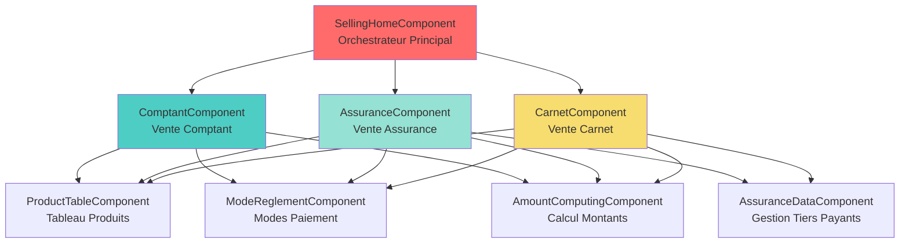

---

## 🔄 WORKFLOW 1 : Ajout de Produit

### État Global

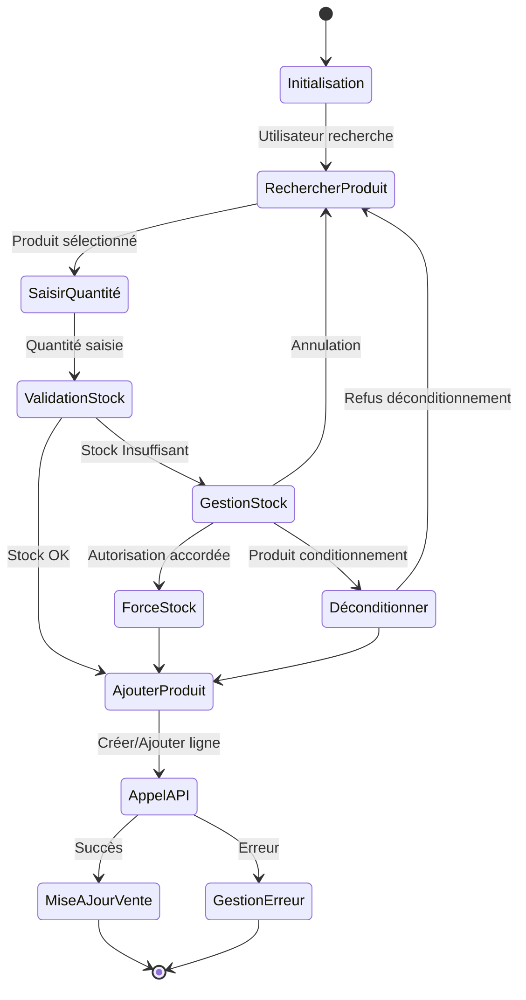

### Workflow Détaillé

#### 1.1 Recherche de Produit

**Paramètres de Recherche :**
- Requête de recherche (minimum 3 caractères)
- Nombre maximum de résultats (par défaut : 50)

**Informations Produit Retournées :**
- ID du produit
- Libellé
- Prix unitaire régulier
- Quantité en stock
- Quantité maximale autorisée
- Indicateur déconditionnement possible
- Nombre d'unités par conditionnement

**Endpoint API :** `GET /api/products/search` avec paramètres query et size

---

#### 1.2 Validation de Stock

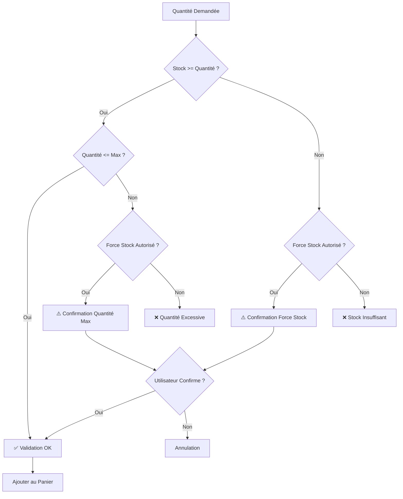

**Logique de Validation :**

**Données Requises :**
- Informations du produit
- Quantité demandée
- Quantité déjà dans le panier
- Permission force stock de l'utilisateur

**Résultat de Validation :**
- Statut valide/invalide
- Raison du rejet (stock insuffisant, quantité excessive, force stock, déconditionnement)
- Nécessite confirmation utilisateur
- Message de confirmation

**Règles de Validation :**

1. **Stock Insuffisant :**
   - Si stock < quantité demandée ET force stock autorisé → Demander confirmation
   - Si stock < quantité demandée ET force stock non autorisé → Bloquer

2. **Quantité Excessive :**
   - Si quantité totale > maximum autorisé ET force stock autorisé → Demander confirmation
   - Si quantité totale > maximum autorisé ET force stock non autorisé → Bloquer

3. **Déconditionnement :**
   - Si produit déconditionnant ET quantité non multiple du conditionnement → Demander confirmation

4. **Validation Réussie :**
   - Tous les critères respectés → Autoriser ajout

---

#### 1.3 Ajout au Panier (COMPTANT)

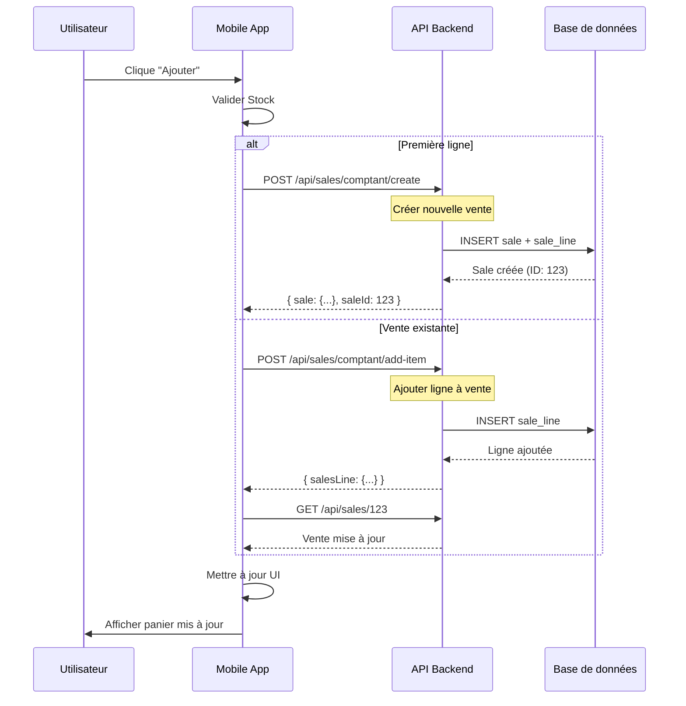

**API Endpoints :**

**Créer Nouvelle Vente Comptant :**
- Endpoint : `POST /api/sales/comptant/create`
- Données requises : lignes de vente (produit ID, quantité, prix), ID caissier, ID vendeur, ID client (optionnel)
- Réponse : ID de la vente créée, lignes de vente, montants totaux

**Ajouter Ligne à Vente Existante :**
- Endpoint : `POST /api/sales/comptant/add-item`
- Données requises : ID de la vente, ID produit, quantité demandée, prix unitaire, quantité vendue

---

#### 1.4 Ajout au Panier (ASSURANCE/CARNET)

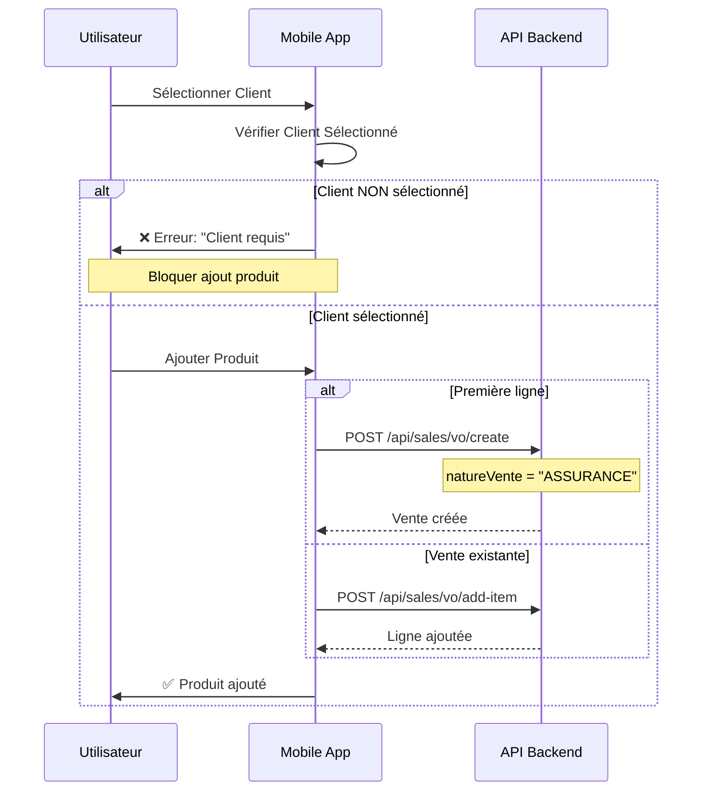

**Différences ASSURANCE vs COMPTANT :**

| Critère | COMPTANT | ASSURANCE/CARNET |
|---------|----------|------------------|
| Client | ❌ Optionnel | ✅ **Obligatoire** |
| Tiers Payants | ❌ Non | ✅ **Obligatoire** (1-3) |
| Numéro Bon | ❌ Non | ✅ **Obligatoire** par tiers payant |
| Plafond | ❌ Non | ✅ Vérifié |
| Prescription | ❌ Non | ⚠️ Optionnel selon client |

---

## 🔄 WORKFLOW 2 : Modification de Produit

### État Global

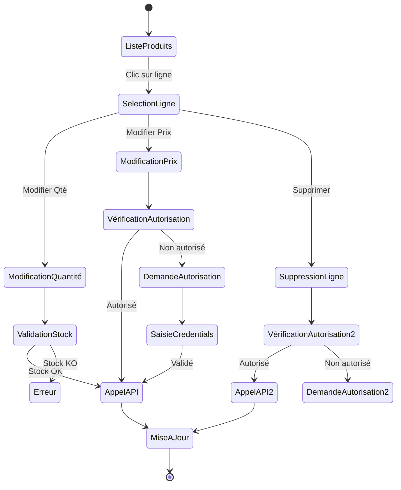

### Workflow Détaillé

#### 2.1 Modification Quantité

**Données Requises :**
- ID de la ligne de vente
- Nouvelle quantité
- ID de la vente

**Endpoint API :** `PUT /api/sales/comptant/update-item-quantity`

**Validation requise :** Même logique que ajout produit

---

#### 2.2 Modification Prix (Nécessite Autorisation)

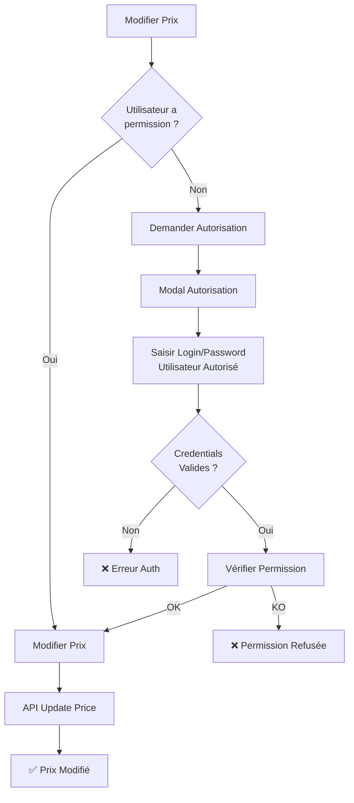

**Endpoint API :** `POST /api/sales/comptant/update-item-price`

**Données Requises :**
- ID de la vente
- ID de la ligne de vente
- Nouveau prix unitaire
- ID du produit
- Quantité demandée

**Permission requise :** `PR_MODIFICATION_PRIX_VENTE`

---

#### 2.3 Suppression Ligne

**Endpoint API :** `DELETE /api/sales/comptant/delete-item/{saleLineId}`

**Permission requise :** `PR_SUPPRIME_PRODUIT_VENTE`

**Workflow identique à modification prix pour l'autorisation**

---

## 🔄 WORKFLOW 3 : Gestion Client

### 3.1 Ajout Client (COMPTANT - Optionnel)

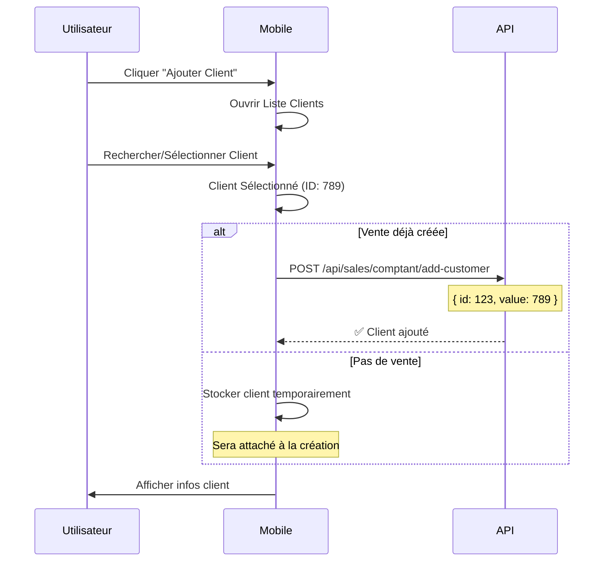

**API Endpoints :**

**Ajouter Client :**
- Endpoint : `POST /api/sales/comptant/add-customer`
- Données : ID de la vente, ID du client

**Retirer Client :**
- Endpoint : `POST /api/sales/comptant/remove-customer`
- Données : ID de la vente

---

### 3.2 Sélection Client (ASSURANCE/CARNET - Obligatoire)

```mermaid
flowchart TD
    A[Écran Vente] --> B{Client<br/>sélectionné ?}
    B -->|Non| C[🔒 Bloquer Ajout Produit]
    B -->|Oui| D[✅ Permettre Ajout]
    
    C --> E[Bouton "Sélectionner Client"]
    E --> F[Modal Recherche Client]
    
    F --> G{Type Client}
    G -->|Assuré| H[Liste Clients Assurés]
    G -->|Ayant-Droit| I[Liste Ayants-Droit]
    
    H --> J[Sélectionner Client]
    I --> J
    
    J --> K{Client a<br/>Tiers Payants ?}
    K -->|Oui| L[Charger Tiers Payants]
    K -->|Non| M[Créer Tiers Payants]
    
    L --> N[Client Sélectionné]
    M --> N
    N --> D
```

**Recherche Client :**

**Clients Assurés :**
- Endpoint : `GET /api/customers/search/assures`
- Paramètre : query (texte de recherche)

**Ayants-Droit d'un Client :**
- Endpoint : `GET /api/customers/{customerId}/ayants-droit`

**Informations Client Retournées :**
- ID, prénom, nom, nom complet
- Téléphone mobile, email
- Type (ASSURE ou AYANT_DROIT)
- ID du parent (si ayant-droit)
- Liste des tiers payants
- Plafonds mensuel et annuel
- Montants consommés mensuel et annuel

---

## 🔄 WORKFLOW 4 : Gestion Tiers Payants (ASSURANCE uniquement)

### Architecture

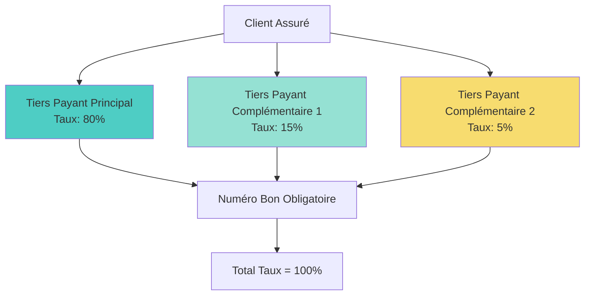

### Workflow Détaillé

```mermaid
sequenceDiagram
    participant U as Utilisateur
    participant M as Mobile
    participant A as API

    U->>M: Sélectionner Client
    M->>A: GET /api/customers/{id}
    A-->>M: Client + Tiers Payants
    
    M->>M: Charger Tiers Payants Existants
    
    alt Tiers Payants Existe
        M->>U: Afficher Tiers Payants
    else Pas de Tiers Payants
        M->>U: Afficher "Ajouter Tiers Payant"
    end
    
    U->>M: Ajouter Complémentaire
    M->>M: Modal Tiers Payants
    U->>M: Sélectionner Tiers Payant
    U->>M: Saisir Taux (%)
    U->>M: Saisir Numéro Bon
    
    M->>M: Valider Total Taux ≤ 100%
    
    alt Total > 100%
        M->>U: ❌ Erreur: Taux total > 100%
        Note over M,U: Ajustement requis
    else Total ≤ 100%
        M->>M: ✅ Ajouter Tiers Payant
        M->>U: Afficher Liste Mise à Jour
    end

### Structure Tiers Payant

**Informations Tiers Payant :**
- ID (optionnel pour nouveau)
- ID du tiers payant
- Libellé du tiers payant
- Taux de prise en charge (entre 0 et 100%)
- Numéro de bon (obligatoire)
- Montant restant disponible (plafond)
- Ordre (0 = Principal, 1+ = Complémentaire)

**Validation Tiers Payants :**

**Règles de Validation :**
1. Au moins un tiers payant requis
2. Total des taux ne doit pas dépasser 100%
3. Chaque tiers payant doit avoir un numéro de bon valide

**Messages d'Erreur :**
- "Au moins un tiers payant requis"
- "Total des taux (X%) dépasse 100%"
- "Numéro de bon manquant pour [Nom Tiers Payant]"

### API Endpoints

**Récupérer Tiers Payants d'un Client :**
- Endpoint : `GET /api/customers/{customerId}/tiers-payants`

**Rechercher Tiers Payants Disponibles :**
- Endpoint : `GET /api/tiers-payants/search`
- Paramètre : query (texte de recherche)

**Ajouter Tiers Payant à un Client :**
- Endpoint : `POST /api/customers/{customerId}/tiers-payants`
- Données : ID tiers payant, taux, numéro de bon, ordre

---

## 🔄 WORKFLOW 5 : Finalisation Vente

### Vue d'Ensemble

```mermaid
stateDiagram-v2
    [*] --> VérifPanier
    VérifPanier --> VérifClient: Panier non vide
    VérifPanier --> Erreur: Panier vide
    
    VérifClient --> VérifTiersPayants: VO (Client obligatoire)
    VérifClient --> SaisiePaiement: Comptant
    
    VérifTiersPayants --> VérifBons: Tiers Payants OK
    VérifTiersPayants --> Erreur: Pas de Tiers Payants
    
    VérifBons --> VérifPlafond: Bons OK
    VérifBons --> ConfirmSansBon: Bon manquant
    
    ConfirmSansBon --> VérifPlafond: Utilisateur confirme
    ConfirmSansBon --> Annulation: Utilisateur refuse
    
    VérifPlafond --> ChoixModeRéglement: Plafond OK
    VérifPlafond --> Erreur: Plafond dépassé
    
    SaisiePaiement --> VérifMontant
    ChoixModeRéglement --> VérifMontant
    
    VérifMontant --> VérifCaisse: Montant OK
    VérifMontant --> VenteDifférée: Reste à payer
    
    VérifCaisse --> Finalisation: Caisse ouverte
    VérifCaisse --> OuvrirCaisse: Caisse fermée
    
    OuvrirCaisse --> Finalisation
    VenteDifférée --> Finalisation
    
    Finalisation --> Impression: Vente enregistrée
    Impression --> [*]: Terminé
```

---

### 5.1 Finalisation COMPTANT

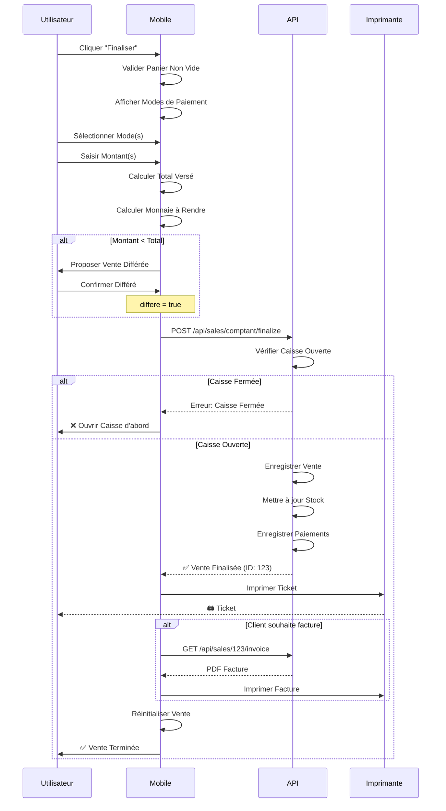

**Données de Finalisation :**

**Informations Requises :**
- ID de la vente
- Mettre en attente (booléen)
- Montant total versé
- Commentaire (optionnel)
- Est un avoir (booléen)
- Liste des paiements

**Informations de Paiement :**
- Code mode règlement (CASH, CB, MOBILE, CHEQUE)
- Montant
- ID du mode règlement

**Exemple de Finalisation :**
- Vente ID : 123
- Pas en attente
- Montant versé : 15000 F
- Paiements : Espèces (10000 F) + Mobile Money (5000 F)

**Endpoint API :** `POST /api/sales/comptant/finalize`

**Réponse :**
- ID de la vente
- Succès (booléen)
- Imprimer ticket (booléen)
- Imprimer facture (booléen)

---

### 5.2 Finalisation ASSURANCE/CARNET

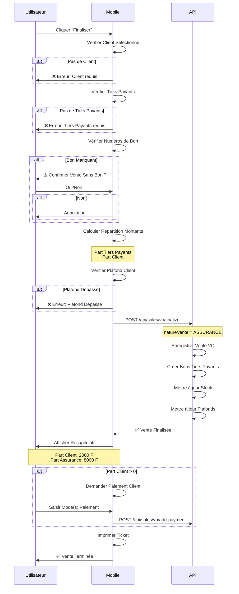

**Données de Finalisation VO :**

**Informations Requises :**
- ID de la vente
- Liste des tiers payants avec taux et numéros de bon
- Mettre en attente (booléen)
- Montant versé par le client (part client)
- Liste des paiements effectués par le client
- Commentaire (optionnel)

**Réponse API :**
- ID de la vente
- Part client (montant à payer par le client)
- Part tiers payants (montant couvert par les assurances)
- Détails par tiers payant (libellé, montant, taux, numéro de bon)

**Calcul de Répartition :**

**Logique :**
1. Pour chaque tiers payant, calculer : (Montant Total × Taux) ÷ 100
2. Arrondir le résultat
3. Additionner tous les montants des tiers payants
4. Part client = Montant Total - Somme des parts tiers payants

**Exemple :**
- Montant total : 10000 F
- Tiers payant 1 (CNPS) : 80% → 8000 F
- Tiers payant 2 (MUTUELLE) : 15% → 1500 F
- Part client : 10000 - (8000 + 1500) = 500 F (5%)

**Endpoint API :** `POST /api/sales/vo/finalize`

---

### 5.3 Vente en Attente (Prévente)

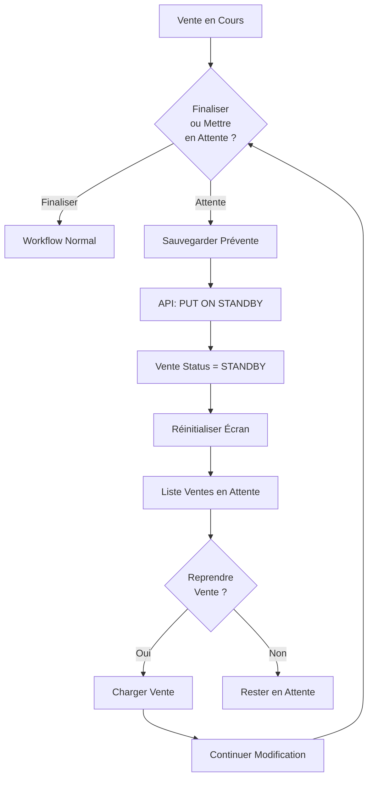

**API Endpoints :**

**Mettre en Attente :**
- Endpoint : `POST /api/sales/comptant/put-on-standby`
- Données : ID de la vente

**Lister Ventes en Attente :**
- Endpoint : `GET /api/sales/pending`
- Retourne : Liste avec ID vente, date, nom client, montant total, nombre d'articles

**Reprendre une Vente :**
- Endpoint : `GET /api/sales/{saleId}`

---

## 🔄 WORKFLOW 6 : Transformation de Vente

### Cas d'Usage

Un client arrive **sans assurance** → Vente COMPTANT créée  
Client retrouve sa **carte d'assurance** → Transformer en ASSURANCE

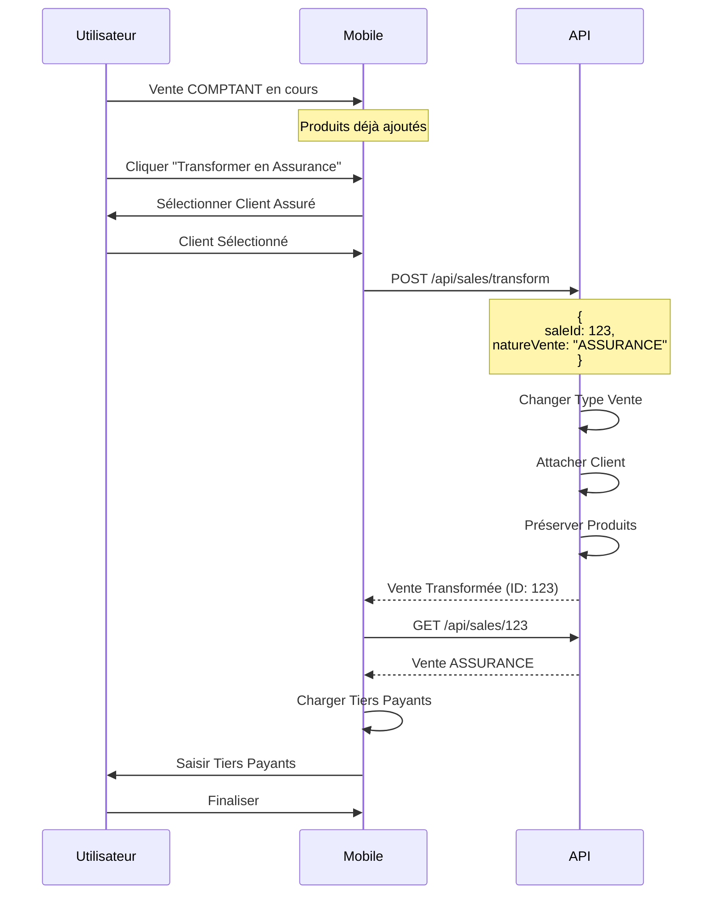

**Endpoint API :** `POST /api/sales/transform`

**Données Requises :**
- ID de la vente
- Nouveau type de vente (ASSURANCE ou CARNET)

**Contraintes :**
- ✅ COMPTANT → ASSURANCE : OK
- ✅ COMPTANT → CARNET : OK
- ❌ ASSURANCE → COMPTANT : KO (perte tiers payants)
- ❌ CARNET → COMPTANT : KO (perte tiers payants)
- ✅ ASSURANCE ↔ CARNET : OK (même structure)

---

## 🔄 WORKFLOW 7 : Modes de Paiement

### Modes Disponibles

| Code | Libellé | Usage | Restrictions |
|------|---------|-------|--------------|
| `CASH` | Espèces | Comptant/VO | Aucune |
| `CB` | Carte Bancaire | Comptant/VO | Montant max configurable |
| `MOBILE` | Mobile Money | Comptant/VO | Vérification transaction |
| `CHEQUE` | Chèque | Comptant/VO | Numéro chèque requis |
| `VIREMENT` | Virement | VO seulement | Référence requise |

### Workflow Paiement Multiple

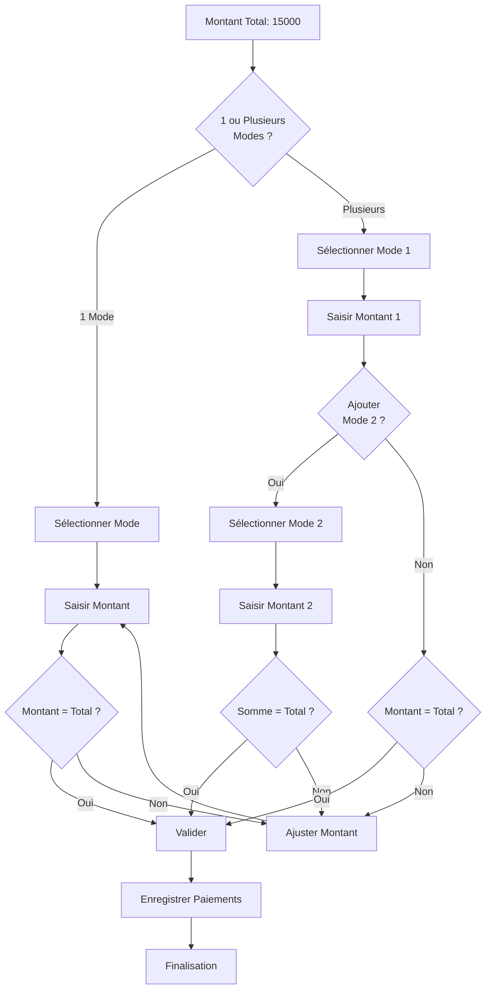

| Code | Libellé | Usage | Restrictions |
| `CASH` | Espèces | Comptant/VO | Aucune |
| `CB` | Carte Bancaire | Comptant/VO | Montant max configurable |
| `MOBILE` | Mobile Money | Comptant/VO | Vérification transaction |
| `CHEQUE` | Chèque | Comptant/VO | Numéro chèque requis |
| `VIREMENT` | Virement | VO seulement | Référence requise |

### Workflow Paiement Multiple


**Exemple Multi-Paiement :**

Montant total : 15000 F
- Paiement 1 : Espèces (CASH) → 10000 F
- Paiement 2 : Mobile Money (MOBILE) → 3000 F
- Paiement 3 : Carte Bancaire (CB) → 2000 F
- Total : 10000 + 3000 + 2000 = 15000 F ✅

**Règles de Validation :**

1. Maximum 2 modes de paiement autorisés
2. La somme des paiements doit être exactement égale au montant total


---

## 📊 Récapitulatif API Endpoints

### Ventes COMPTANT

| Endpoint | Méthode | Description |
|----------|---------|-------------|
| `/api/sales/comptant/create` | POST | Créer nouvelle vente |
| `/api/sales/comptant/add-item` | POST | Ajouter produit |
| `/api/sales/comptant/update-item-quantity` | PUT | Modifier quantité |
| `/api/sales/comptant/update-item-price` | POST | Modifier prix |
| `/api/sales/comptant/delete-item/{id}` | DELETE | Supprimer ligne |
| `/api/sales/comptant/add-customer` | POST | Ajouter client |
| `/api/sales/comptant/remove-customer` | POST | Retirer client |
| `/api/sales/comptant/finalize` | POST | Finaliser vente |
| `/api/sales/comptant/put-on-standby` | POST | Mettre en attente |

### Ventes ASSURANCE/CARNET (VO)

| Endpoint | Méthode | Description |
|----------|---------|-------------|
| `/api/sales/vo/create` | POST | Créer nouvelle vente VO |
| `/api/sales/vo/add-item` | POST | Ajouter produit |
| `/api/sales/vo/update-item-quantity` | PUT | Modifier quantité |
| `/api/sales/vo/update-item-price` | POST | Modifier prix |
| `/api/sales/vo/delete-item/{id}` | DELETE | Supprimer ligne |
| `/api/sales/vo/change-customer` | POST | Changer client |
| `/api/sales/vo/finalize` | POST | Finaliser vente |
| `/api/sales/vo/put-on-standby` | POST | Mettre en attente |
| `/api/sales/transform` | POST | Transformer type vente |

### Clients & Tiers Payants

| Endpoint | Méthode | Description |
|----------|---------|-------------|
| `/api/customers/search/assures` | GET | Rechercher clients assurés |
| `/api/customers/{id}` | GET | Détails client |
| `/api/customers/{id}/ayants-droit` | GET | Ayants-droit |
| `/api/customers/{id}/tiers-payants` | GET | Tiers payants client |
| `/api/tiers-payants/search` | GET | Rechercher tiers payants |

### Produits

| Endpoint | Méthode | Description |
|----------|---------|-------------|
| `/api/products/search` | GET | Rechercher produits |
| `/api/products/{id}` | GET | Détails produit |

### Ventes en Attente

| Endpoint | Méthode | Description |
|----------|---------|-------------|
| `/api/sales/pending` | GET | Liste préventes |
| `/api/sales/{id}` | GET | Charger vente |
| `/api/sales/{id}/delete` | DELETE | Supprimer prévente |

---


## 🔧 Gestion d'Erreurs

### Codes d'Erreur Courants

| Code | Message | Action Mobile |
|------|---------|---------------|
| `stock` | Stock insuffisant | Afficher stock disponible + proposer force |
| `stockChInsufisant` | Stock insuffisant | Bloquer ou proposer force stock |
| `plafondAtteint` | Plafond dépassé | Bloquer vente, afficher plafond restant |
| `bonManquant` | Numéro bon requis | Demander confirmation vente sans bon |
| `clientRequis` | Client obligatoire | Bloquer ajout produit, forcer sélection client |
| `tiersPayantRequis` | Tiers payant manquant | Demander ajout tiers payants |
| `caisseNonOuverte` | Caisse fermée | Proposer ouverture caisse |
| `unauthorized` | Autorisation refusée | Demander credentials utilisateur autorisé |

### Exemple Gestion Erreur

**Processus de Gestion :**

1. **Stock Insuffisant (stock / stockChInsufisant) :**
   - Afficher alerte avec stock disponible
   - Proposer boutons : "Annuler" et "Forcer" (si autorisé)

2. **Plafond Dépassé (plafondAtteint) :**
   - Afficher alerte avec plafond mensuel et montant déjà consommé
   - Bouton : "OK" (blocage)

3. **Client Requis (clientRequis) :**
   - Afficher alerte demandant la sélection d'un client assuré
   - Bouton : "Sélectionner" qui ouvre le sélecteur de client

4. **Erreur Générique :**
   - Afficher message d'erreur générique
   - Bouton : "OK"

---

## 📱 Checklist Implémentation Mobile

### Phase 1 : Fonctionnalités de Base
- [ ] Recherche produits
- [ ] Ajout produit au panier
- [ ] Modification quantité
- [ ] Suppression ligne
- [ ] Affichage total
- [ ] Validation stock basique

### Phase 2 : Gestion Clients
- [ ] Recherche clients
- [ ] Sélection client (COMPTANT)
- [ ] Sélection client assuré (ASSURANCE)
- [ ] Affichage infos client
- [ ] Vérification plafonds

### Phase 3 : Tiers Payants (ASSURANCE)
- [ ] Affichage tiers payants client
- [ ] Ajout tiers payant complémentaire
- [ ] Saisie numéros de bon
- [ ] Validation taux (≤ 100%)
- [ ] Calcul répartition montants

### Phase 4 : Paiement
- [ ] Sélection mode(s) paiement
- [ ] Paiement multiple (max 2)
- [ ] Calcul monnaie à rendre
- [ ] Validation montants

### Phase 5 : Finalisation
- [ ] Finalisation COMPTANT
- [ ] Finalisation ASSURANCE/CARNET
- [ ] Impression ticket (si possible)
- [ ] Gestion vente différée
- [ ] Mise en attente (prévente)

### Phase 6 : Fonctionnalités Avancées
- [ ] Modification prix (avec autorisation)
- [ ] Force stock (avec autorisation)
- [ ] Déconditionnement
- [ ] Transformation type vente
- [ ] Ventes en attente (liste)
- [ ] Reprise vente en attente
- [ ] Suppression vente en attente

### Phase 7 : Hors-Ligne & Sync
- [ ] Stockage local ventes
- [ ] Cache produits
- [ ] Cache clients
- [ ] Synchronisation auto
- [ ] Gestion conflits

### Phase 8 : Optimisations
- [ ] Scan code-barres
- [ ] Raccourcis clavier
- [ ] Recherche rapide
- [ ] Historique recherches
- [ ] Favoris produits

---

## 🎯 Conclusion

Ce document fournit une **vue complète des workflows fonctionnels** du module de vente pour une implémentation mobile efficace. 

### Points Clés à Retenir

1. **3 Types de Ventes** avec logiques distinctes
2. **Client Obligatoire** pour ASSURANCE/CARNET
3. **Tiers Payants** critiques pour ASSURANCE
4. **Validation Stock** multi-niveaux
5. **Paiements Multiples** (max 2 modes)
6. **Autorisations** pour actions sensibles
7. **Préventes** pour workflow interrompu
8. **Transformation** entre types de vente

### Ressources Supplémentaires


- **Environnements** : Dev, Staging, Prod

**Bonne implémentation ! 📱✨**


